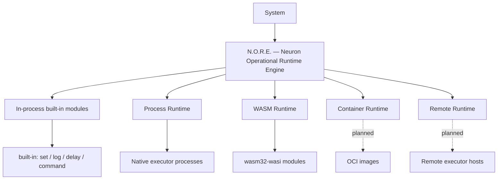
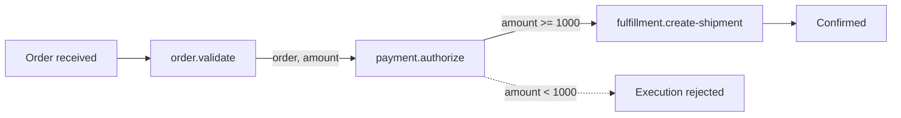
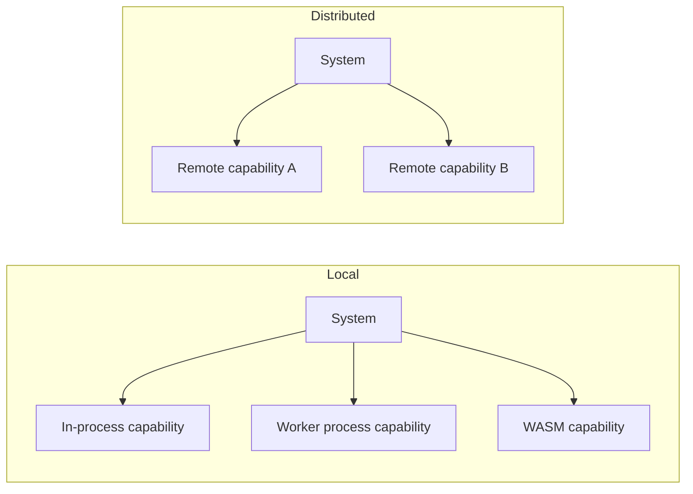
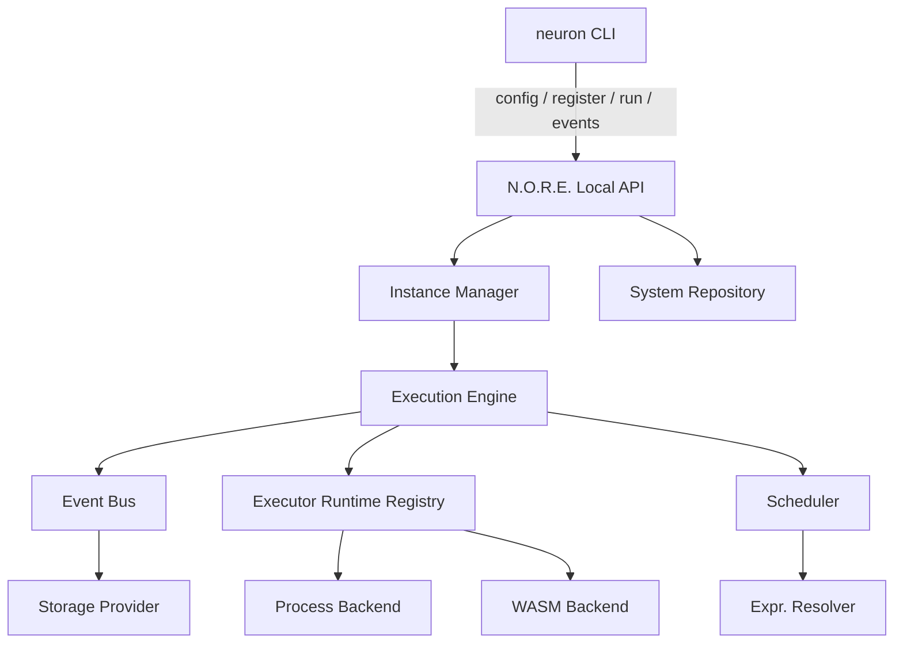
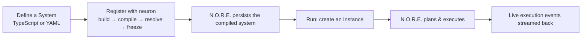
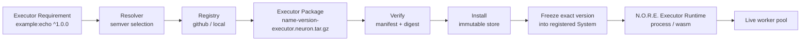

# Neuron

**A runtime for building and operating complex software systems from composable, executable capabilities.**

Neuron treats software as a composition of **capabilities** connected by **explicit relationships** and operated by a runtime that does not need to understand what those capabilities are.

> Software should be composed from things that can do something, connected by explicit relationships, and operated by a runtime that does not need to understand what those things are.

[Version](https://github.com/Muhammad-Jay/neuron/releases)
[Go](https://go.dev)
[TypeScript](https://www.typescriptlang.org)
[License](./LICENSE)

---


## The Runtime Model

Neuron defines a deliberately small set of primitives. Each one owns a single responsibility and deliberately ignores everything else:


| Primitive     | Responsibility                                               | What it deliberately never knows       |
| ------------- | ------------------------------------------------------------ | -------------------------------------- |
| **System**    | Defines what exists and how it is connected                  | How capabilities are implemented       |
| **Service**   | Exposes one executable capability                            | How the capability is executed         |
| **Connector** | Defines how two capabilities communicate                     | The business meaning of the data       |
| **Executor**  | Provides the machinery that runs a Service                   | The composition of the System          |
| **Instance**  | A living realization of a System                             | Implementation details of its Services |
| **N.O.R.E.**  | Operates registered Systems — instantiate, schedule, execute | What any capability actually means     |


N.O.R.E. (**Neuron Operational Runtime Engine**) is the runtime at the center. A System describes what should exist; N.O.R.E. makes it operational — and hosts each capability through an **Executor boundary** that keeps the runtime independent of any single technology.




> [!IMPORTANT]
> Neuron is **not** a workflow engine. A workflow is one thing a System can represent — it is not the boundary of the platform. The fundamental abstraction is a System of capabilities and explicit relationships.

A Service does not have to be a "microservice". A database query, an HTTP call, a model prediction, a browser automation task, a WebAssembly module, a native program, or another System can all be capabilities. What matters is the **contract** describing what a capability provides and how it can be reached.

> [!NOTE]
> A Service is a capability, not necessarily a process, function, API, or worker. A Connector is a relationship, not necessarily an HTTP request.

---


## Build a System

Systems are defined in TypeScript with the (`@neuron/sdk`)`[@neuron/sdk](https://github.com/Muhammad-Jay/neuron/blob/main/packages/sdk)` — a typed, autocompleted system-definition language — or in YAML. Both authoring surfaces converge on the **same canonical manifest** before anything runtime-specific happens.

Here is a real order-fulfillment definition. Three independent capabilities, wired by explicit relationships, executed by the Neuron runtime:

```ts
import { Service, System } from "@neuron/sdk";

type Address = { street: string; city: string; zip: string };
type OrderItem = { sku: string; name: string; qty: number; priceCents: number };
type Order = {
  id: string;
  customerId: string;
  customerEmail: string;
  currency: string;
  totalCents: number;
  items: OrderItem[];
  shippingAddress: Address;
};

const validateOrder = Service({
  name: "order.validate",
  version: "1.0.0",
  description: "Validate an incoming order",
})
  .executor({ name: "neuron:core:set" })
  .inputSchema<{ order: Order }>()
  .outputSchema<{ order: Order; valid: boolean }>();

const authorizePayment = Service({
  name: "payment.authorize",
  version: "1.0.0",
  description: "Authorize payment for an order",
})
  .executor({ name: "neuron:core:set" })
  .inputSchema<{ order: Order; amountCents: number; currency: string }>()
  .outputSchema<{ order: Order; amountCents: number }>();

const createShipment = Service({
  name: "fulfillment.create-shipment",
  version: "1.0.0",
  description: "Create a shipment for a paid order",
})
  .executor({ name: "neuron:core:set" })
  .inputSchema<{ order: Order }>()
  .outputSchema<{ order: Order; trackingId: string }>();

const manifest = System({
  name: "order-fulfillment",
  version: "1.0.0",
  description: "Validate, authorize, and fulfill customer orders",
})
  .inputSchema<{ order: Order }>()
  .withParams((input) =>
    validateOrder
      .withInput({ order: input.order })
      .next(
        authorizePayment.withInput({
          order: validateOrder.output.order,
          amountCents: validateOrder.output.order.totalCents,
          currency: validateOrder.output.order.currency,
        })
      )
      .next(
        createShipment.withInput({
          order: authorizePayment.output.order,
        }),
        {
          when: authorizePayment.output.amountCents.greaterThanOrEqualTo(1000),
          message: "Payment authorization threshold not met",
        }
      )
  )
  .toManifest();

export default manifest;
```


### What this definition establishes




1. **Three independently executable capabilities** — `order.validate`, `payment.authorize`, `fulfillment.create-shipment`. Neuron does not require them to share an implementation language, process, deployment model, or infrastructure.
2. **Explicit relationships** — `.next()` chains data from one capability to the next; `.withInput()` maps output fields to the next input contract; `{ when: ... }` guards whether a step runs at all.
3. **A stationary boundary** — the System defines *what* and *how things connect*. The Executors determine *how each capability actually runs*: in-process, as a native worker process, or as a WebAssembly module.

The complete, runnable version of this pipeline ships in `examples/ecommerce_order_ts`. The same logic expressed in YAML lives in `examples/ecommerce_order`.

---


## Why Neuron

The boundary Neuron introduces is between the **definition of a system** and the **mechanisms that execute it**.


| Without a runtime model                 | With Neuron                                     |
| --------------------------------------- | ----------------------------------------------- |
| Application-specific integration code   | Explicit Service contracts                      |
| Implementation leaks into composition   | A stable Executor boundary                      |
| Runtime coupled to one technology stack | Runtime operates contracts, not implementations |
| A single deployment model               | Multiple executor runtimes (process, WASM, …)   |
| Implicit, ad-hoc relationships          | Explicit Connectors                             |
| Configuration-heavy composition         | Typed System definitions                        |


Because capabilities are reached through contracts, the same System can run entirely locally today and distribute individual capabilities later — the physical location never has to redefine the logical architecture.




> [!WARNING]
> WebAssembly and out-of-process execution are **execution boundaries**, not a requirement for every Service. They exist so a capability can be portable, isolated, and independently implemented, not so every capability must become one.


## N.O.R.E. as a Small Operating Environment

An operating system provides processes, memory, resources, communication, isolation, and scheduling. N.O.R.E. applies the same discipline one level higher: Systems, Instances, Services, Executors, Connectors, resource management, and execution. The kernel stays small; capabilities live outside it.




You never interact with N.O.R.E. directly. The `neuron` CLI starts it, checks its health, talks to it over a local Unix socket, and stops it — from your perspective there is a single product.

---


## How a System Runs




| Stage            | Responsibility                                                                        |
| ---------------- | ------------------------------------------------------------------------------------- |
| **Definition**   | Author a System in TypeScript or YAML using the SDK or the YAML surface               |
| **Manifest**     | Produce the canonical System representation both surfaces agree on                    |
| **Validation**   | Verify structural and semantic correctness                                            |
| **Compilation**  | Build the runtime representation from the canonical manifest                          |
| **Resolution**   | Resolve required external executor packages and freeze exact versions                 |
| **Registration** | Hand the compiled System + frozen executor set to N.O.R.E.                            |
| **Instance**     | Create a living realization of the registered System                                  |
| **Execution**    | N.O.R.E. schedules Services across connectors and runs them through executor runtimes |


```bash
# The fastest way to feel Neuron — run the shipped order pipeline
git clone https://github.com/Muhammad-Jay/neuron.git
cd neuron/examples/ecommerce_order_ts
pnpm install
neuron register          # build the TS project, compile, register with the runtime
neuron run               # create an instance and stream live execution events
```

Walk through it in detail in [docs/GETTING_STARTED.md](./docs/GETTING_STARTED.md).

---


## Executors & External Modules

A Service is the logical capability. An **Executor** is the machinery that makes it operate. Neuron distinguishes two kinds:

- **Built-in modules** — shipped inside N.O.R.E., run in-process, require no resolution or installation (for example `neuron:core:set`).
- **External modules (executors)** — authored, packaged, distributed, and hosted independently. N.O.R.E. resolves them, verifies them, installs them immutably, and executes them out-of-process as native processes or WebAssembly modules.

External modules share one unified contract: an `executor.json` manifest (identity, runtime type, protocol, platforms), a canonical package archive, and a declared wire protocol (`neuron/executor-v1` over gRPC, or `neuron/executor-v1-json` over stdio).




The exact resolved version is **frozen into every registered system**, so instances run the precise modules that were verified at registration time — reproducibly, and offline.

> [!WARNING]
> Neuron treats external executors as untrusted code. Artifacts are verified by digest before installation and hosted out-of-process, never inside the runtime's address space. GitHub is a distribution source, not a security boundary.

See [docs/MODULES.md](./docs/MODULES.md) for the full module model and how to author one. A reference executor (`examples/executors/echo`) ships in this repository, compiled to both a native binary and a WebAssembly module from a single Go source.

---


## Installation

Neuron is one product: the `neuron` CLI plus the N.O.R.E. runtime engine, distributed as a single archive for your platform. There is no daemon to install or service to manage — the CLI runs the engine for you.


| Platform | Architectures    |
| -------- | ---------------- |
| Linux    | `amd64`, `arm64` |
| macOS    | `amd64`, `arm64` |
| Windows  | `amd64`          |


1. Download the latest release archive for your platform from the [releases page](https://github.com/Muhammad-Jay/neuron/releases).
2. Extract it and place `neuron` on your `PATH`.
3. Verify:

```bash
neuron version
```

See [docs/INSTALLATION.md](./docs/INSTALLATION.md) for the complete guide, including installing from source and verifying release checksums.

---


## Documentation


|                         |                                                                                                            |
| ----------------------- | ---------------------------------------------------------------------------------------------------------- |
| **Getting started**     | Build and run your first System in TypeScript — [docs/GETTING_STARTED.md](./docs/GETTING_STARTED.md)       |
| **Architecture**        | The canonical pipeline and the boundaries that never blur — [docs/ARCHITECTURE.md](./docs/ARCHITECTURE.md) |
| **Modules & executors** | The unified module model, packaging, resolution, and protocol — [docs/MODULES.md](./docs/MODULES.md)       |
| **Installation**        | Official release and from-source installs — [docs/INSTALLATION.md](./docs/INSTALLATION.md)                 |
| **TypeScript SDK**      | Define systems as typed, composable capabilities — [packages/sdk/README.md](./packages/sdk/README.md)      |
| **Go executor SDK**     | Build production executors — [packages/executor-go/README.md](./packages/executor-go/README.md)            |
| **.NET executor SDK**  | Build production executors with C#/.NET — [packages/executor-dotnet/README.md](./packages/executor-dotnet/README.md) |
| **CLI reference**       | Every `neuron` command and flag — [application/README.md](./application/README.md)                         |
| **N.O.R.E.**            | The runtime engine in depth (maintainer-focused) — [nore/README.md](./nore/README.md)                      |
| **Status**              | What is available, experimental, and planned — [docs/STATUS.md](./docs/STATUS.md)                          |


## Repository

`neuron` is a monorepo with strict architectural boundaries:


| Path                    | Responsibility                                                                      |
| ----------------------- | ----------------------------------------------------------------------------------- |
| `application/`          | The `neuron` CLI — authoring, building, module resolution, client, daemon bootstrap |
| `nore/`                 | N.O.R.E. — the Neuron Operational Runtime Engine                                    |
| `shared/`               | Canonical types and protocol contracts agreed on by both Go modules                 |
| `packages/sdk/`         | `@neuron/sdk` — TypeScript system-definition language                               |
| `packages/executor-go/`        | Go SDK for authoring Neuron modules (executors)                                                        |
| `packages/executor-dotnet/`    | .NET SDK for authoring Neuron modules (`Neuron.Executor`)                                               |
| `examples/`             | Runnable systems and reference executors                                            |
| `docs/`                 | Architecture, getting started, installation, module, and runtime docs               |


`application` and `nore` are **separate Go modules**. They agree only through the canonical types and protocol contracts in `shared`. The CLI never reaches into runtime internals; the runtime never parses YAML or TypeScript.

---


## Project Status

**Version** `0.1.0` — first public development release. The core is implemented and deliberately structured for long-term growth; everything is still subject to change until 1.0.

- **Working today:** the `neuron` CLI, system definition in TypeScript and YAML, compilation and registration, N.O.R.E., built-in modules, external modules hosted as processes or WebAssembly, instances, and execution with live event streaming.
- **Experimental:** the external module ecosystem, GitHub-based module resolution, and several runtime refinements.
- **Planned:** runtime hardening (API authentication, resource limits, retention policies), broader module distribution, and additional execution models.

> [!NOTE]
> The docs describe current behavior and architectural direction. Where a capability is designed for but not yet shipped — container/remote runtimes, TLS, execution-retention policies — it is labeled as planned, not promised.

See [docs/STATUS.md](./docs/STATUS.md) for the exact supported surface and [TODO.md](./TODO.md) for known work.

## Roadmap

- **0.1.x** — stabilization of the 0.1.0 foundation: bug fixes, documentation corrections, installation refinements, runtime correctness.
- **0.2.x** — new runtime capabilities, a broader external module ecosystem, and new SDK capabilities as they mature.
- **1.0** — a stable public model and compatibility guarantees.


## Development

The repository is a Go workspace plus a pnpm monorepo.

```bash
# Prerequisites: Go 1.26.5+, pnpm 10.33.0 (10.x), Node.js, .NET SDK 10

go test   ./nore/... ./application/... ./shared/... ./packages/executor-go/... ./examples/simple_response/...
go vet    ./nore/... ./application/... ./shared/... ./packages/executor-go/... ./examples/simple_response/...
go build  ./nore/... ./application/... ./shared/... ./packages/executor-go/... ./examples/simple_response/...

dotnet build packages/executor-dotnet/Neuron.Executor.slnx -c Release   # .NET executor SDK
dotnet test  packages/executor-dotnet/Neuron.Executor.slnx -c Release

pnpm install
pnpm build:sdk
pnpm test:sdk
pnpm typecheck:sdk
```

Or run the convenience helper — `npm run script` — which validates every Go module and npm package in the workspace.

A local smoke test of the full product flow:

```bash
go build -o /tmp/neuron ./application/cmd/neuron
/tmp/neuron version
cd examples/ecommerce_order_ts && /tmp/neuron register && /tmp/neuron run
```

Contributions follow the repository's engineering contract: preserve architectural boundaries, avoid duplication, remove dead code, and test at the correct boundary.

---


## License

Neuron is released under the MIT License. See [LICENSE](./LICENSE).