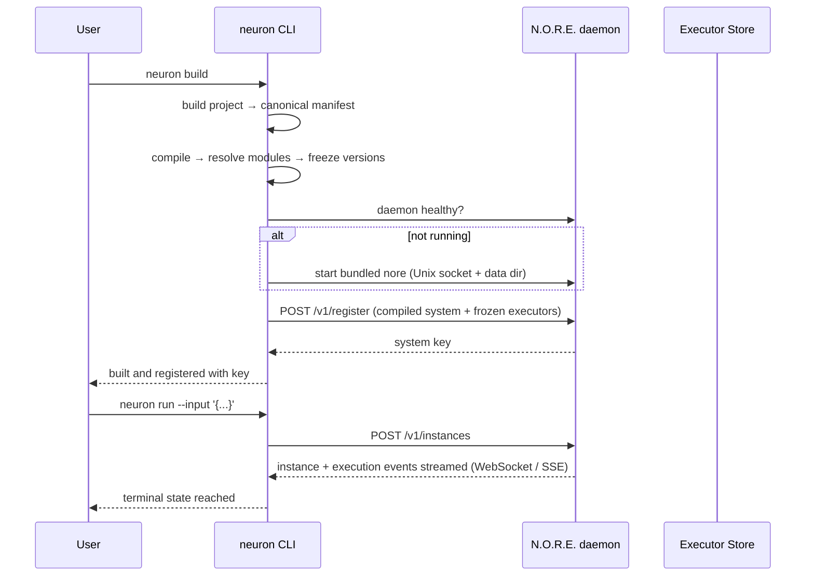
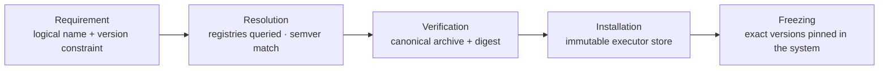

# Neuron Command Line Reference

The `neuron` CLI is the single user-facing interface to Neuron: author projects, build and register systems, manage external modules, create instances, execute systems, and stream execution events while it manages the N.O.R.E. runtime engine (the daemon) for you in the background.

> [!IMPORTANT]
> You never interact with the N.O.R.E. daemon directly. The CLI starts it, checks its health, talks to it over a local Unix socket, and stops it. From the user's perspective there is a single product: `neuron`.

Everything in the [command reference](#command-reference) is generated from the actual command definitions in this module (`application/cmd/neuron` and `application/internal/cli`), so it stays accurate as long as it is kept in sync with the code.




[Version](https://github.com/Muhammad-Jay/neuron/releases)
[Go](https://go.dev)
[License](../LICENSE)

---


## Table of Contents

- [Install & Verify](#install--verify)
- [How the CLI Talks to N.O.R.E.](#how-the-cli-talks-to-nore)
- [Global Flags](#global-flags)
- [Command Reference](#command-reference)
- [Configuration Reference](#configuration-reference)
- [Module Resolution](#module-resolution)
- [Building the CLI](#building-the-cli)


## Install & Verify

Neuron is distributed as a single archive containing the `neuron` CLI and the N.O.R.E. runtime. You only place `neuron` on your `PATH`.

```bash
neuron version
```

See [docs/INSTALLATION.md](../docs/INSTALLATION.md) for the full installation guide.

## How the CLI Talks to N.O.R.E.

The CLI communicates with the N.O.R.E. daemon over a local Unix domain socket. When you run a command that needs the runtime, the CLI automatically:

1. Checks whether the daemon is already healthy.
2. If not, starts it from the bundled `nore` binary with the effective configuration (socket path, data directory, worker count).
3. Talks to it over the socket.

The daemon runs as a persistent background process: it survives the CLI process and keeps serving instances until you stop it with `neuron daemon stop`. The socket defaults to `~/.neuron/nore.sock` and can be overridden with the `NEURON_SOCKET` environment variable or the `daemon.socket` configuration value. A remote daemon can be used instead with the `--remote` flag.


| Transport            | Purpose                                                            |
| -------------------- | ------------------------------------------------------------------ |
| JSON over HTTP       | Regular requests — registration, instance and execution management |
| WebSocket (`/v1/ws`) | Live execution event streaming                                     |
| Server-Sent Events   | Streaming fallback for transports without WebSocket support        |


## Global Flags

The following flags are available on every `neuron` command.


| Flag                 | Description                                                      |
| -------------------- | ---------------------------------------------------------------- |
| `--config string`    | Project config file (one of `neuron.config.json` / `.yaml` / `.yml`; auto-discovered) |
| `--log-level string` | Logging level (default `"info"`)                                 |
| `-v, --verbose`      | Enable verbose output (shows N.O.R.E. daemon logs)               |
| `--remote string`    | Remote N.O.R.E. endpoint (e.g., `https://api.nore.example.com`)  |
| `--nore-path string` | Path to the `nore` daemon binary                                 |
| `--force`            | Force replacement (clear existing state before the command acts) |
| `-h, --help`         | Help for the command                                             |
| `--version`          | Print the CLI version and exit                                   |


## Command Reference


### `neuron version`

Print the Neuron CLI version.

```bash
neuron version
neuron --version
```

Both print the same version. The version is injected at build time from the release tag; a development build reports `dev`.

### `neuron init`

Initialize a new Neuron workspace.

```
Usage:
  neuron init [Target] [flags]

Flags:
  -l, --lang string   project authoring language (ts, typescript, yaml, yml) (default "ts")
```

`Target` is the directory to create (relative to the current directory). `neuron init` creates the directory and scaffolds a runnable project: a `neuron.config.json`, and — for the default TypeScript authoring surface — a `package.json` declaring `@neuron/sdk`, a `tsconfig.json`, a starter `system.ts`, and the canonical local executor root `neuron/executors/`.

```bash
# Create ./my-system as a TypeScript project (default)
neuron init my-system

# Create ./my-system as a YAML project
neuron init my-system --lang yaml
```

The scaffolded config declares the authoring language and entry file:

```json
{
  "lang": "typescript",
  "entry": "system.ts",
  "runtime": { "execution": { "mode": "wait", "timeout": "30m" } },
  "executors": { "localRoots": ["./neuron/executors"] },
  "inspector": { "enabled": true, "address": "127.0.0.1:7433" }
}
```

### `neuron build`

Build the current project and register the system with N.O.R.E.

```
Usage:
  neuron build [flags]

Flags:
  -l, --lang string   project authoring language (yaml, yml, typescript, ts)
  -r, --root string   project root (defaults to the current directory)
```

`neuron build` runs the full authoring pipeline in one step:

| Step         | Responsibility                                                                                                                                                                                                                             |
| ------------ | ------------------------------------------------------------------------------------------------------------------------------------------------------------------------------------------------------------------------------------------ |
| **Build**    | The project (YAML or TypeScript) is resolved into the canonical `.neuron/manifest.json`                                                                                                                                                    |
| **Compile**  | The canonical manifest is compiled into a runtime system representation                                                                                                                                                                    |
| **Resolve**  | External module requirements are resolved through the configured registries, installed into the local store, and the exact versions are frozen into the build record. Built-in modules are skipped — they run in-process inside N.O.R.E. |
| **Register** | The compiled system and its frozen module set are sent to N.O.R.E., which persists it and returns a system key                                                                                                                             |

The CLI records the registration key in `.neuron/register.json` and prints it on success:

```text
order-processing@1.0.0#a1b2c3d4:development
```

```bash
# Build the project in the current directory (language auto-detected)
neuron build

# Force a language and a different project root
neuron build --lang typescript --root ./pipeline

# Replace any previously registered version of this system
neuron build --force
```

After the build, `neuron run` executes the registered system.

> `neuron register` is a deprecated alias of `neuron build`, hidden from help, kept for existing workflows. It will be removed.

### `neuron run`

Run a Neuron System.

```
Usage:
  neuron run [instance-id|system-key] [flags]

Flags:
      --detach         Return execution handles immediately without streaming live events
      --input string   JSON input payload for execution (e.g., '{"key":"value"}')
  -v, --verbose        Enable verbose output to display event payloads
```

`neuron run` asks N.O.R.E. to create an instance and execute a system, then streams live execution events back to the terminal over the WebSocket endpoint, falling back to Server-Sent Events when WebSocket is unavailable.

Without an argument, `neuron run` runs the registered system: it loads the registration key recorded by `neuron build` from `.neuron/register.json`. With a target argument it runs that instance directly, which is useful for re-running an existing instance without a local registration:

| Target form             | Example                             | Meaning                                  |
| ----------------------- | ----------------------------------- | ---------------------------------------- |
| Instance ID             | `inst_ab12cd`                       | Run the instance with that exact ID      |
| Key, colon form         | `order-processing:1.0.0`            | Run the system at that version           |
| Key, at form            | `order-processing@1.0.0`            | Same as the colon form                   |
| Bare name               | `order-processing`                  | Run the key's latest registered version  |

Remaining key segments (`:hash`, `:env`) are preserved as given. Instance IDs (`inst_*`) pass through unchanged; anything else is parsed as a system key and normalized to its colon-encoded wire form. When no argument is given and the project is not built, the command stops with a message pointing you at `neuron build`.

```bash
# Run the registered system with no input, streaming events
neuron run

# Provide input
neuron run --input '{"order": {"id": "ord_123", "total": 4250, "currency": "USD"}}'

# Re-run a specific instance
neuron run inst_ab12cd

# Run the latest registered version of a named system
neuron run order-processing

# Show event payloads
neuron run -v

# Start execution and return immediately with execution/instance handles
neuron run --detach
```

The command always asks N.O.R.E. to accept the execution asynchronously (HTTP `202`, returning execution ID, instance ID, and status), and then decides how to present it: by default it streams live events until the execution reaches a terminal state (`execution.completed`, `execution.failed`, or `execution.cancelled`), while `--detach` prints the returned handles and returns immediately so you can follow progress with `neuron instance list`. `service.log` events render their level and message inline; other event payloads are shown only with `-v`, which also attaches the daemon's output.

### `neuron add`

Resolve and install an external module (executor) into the local store.

```
Usage:
  neuron add [name@version] [flags]
```

`name@version` selects an exact or constrained version (for example `example:echo` or `example:echo@^1.0.0`). Without a version, the best matching version is installed.

```bash
# Install the latest version
neuron add example:echo

# Install a specific version
neuron add example:echo@1.0.0

# Install a version that satisfies a constraint
neuron add example:echo@^1.0.0
```

Installed modules are stored immutably under the executor store directory (`~/.neuron/executors` by default). See [Module Resolution](#module-resolution) and [docs/MODULES.md](../docs/MODULES.md).

### `neuron remove`

Remove an installed external module (executor).

```
Usage:
  neuron remove [name@version] [flags]
```

```bash
neuron remove example:echo@1.0.0
```


### `neuron executor`

Manage external executor (module) packages installed in the local store.

```
Usage:
  neuron executor [flags]
  neuron executor [command]

Available Commands:
  inspect     Inspect an installed executor
  list        List installed executors
```


#### `neuron executor list`

List installed executors.

```
Flags:
  -t, --type string   filter by executor type
```

```bash
# List everything installed
neuron executor list

# Only show executors of one type
neuron executor list --type process
```


#### `neuron executor inspect`

Inspect an installed executor.

```
Usage:
  neuron executor inspect [name@version] [flags]
```

```bash
neuron executor inspect example:echo@1.0.0
```


### `neuron instance`

Create, list, and manage running system instances.

```
Usage:
  neuron instance [flags]
  neuron instance [command]

Available Commands:
  clear       Remove all instances and their executions and events
  list        List instances or executions of a specific instance
  remove      Remove an instance and its executions and events
```

An instance is a living realization of a registered system. `neuron run` creates one implicitly.

#### `neuron instance list`

List instances, or executions of a specific instance.

```
Usage:
  neuron instance list [instance-id] [flags]

Flags:
  -a, --all             List all instances including inactive ones
  -s, --status string   Filter instances by a specific status (e.g., running, stopped)
  -t, --target string   List executions of the instance with the given ID
```

```bash
# List all current instances
neuron instance list

# Show everything, including inactive instances
neuron instance list --all

# Filter by status
neuron instance list --status running

# List executions of one instance
neuron instance list --target <instance-id>
```


#### `neuron instance remove`

Remove an instance and its executions and events.

```
Usage:
  neuron instance remove [instance-id|system-key] [flags]

Aliases:
  remove, rm
```

```bash
neuron instance remove <instance-id>
neuron instance rm <instance-id>
```


#### `neuron instance clear`

Remove **all** instances and their executions and events.

```
Usage:
  neuron instance clear [flags]
```

```bash
neuron instance clear
```


### `neuron daemon`

Manage the local N.O.R.E. daemon.

```
Usage:
  neuron daemon [flags]
  neuron daemon [command]

Available Commands:
  stop        Stop the background N.O.R.E. daemon
```

The daemon is normally started automatically on first use and keeps running in the background until you stop it. `neuron daemon stop` shuts it down gracefully; it is not tied to any single CLI process.

```bash
# Stop the background daemon
neuron daemon stop
```


### `neuron completion`

Generate the autocompletion script for your shell (bash, zsh, fish, or powershell).

```bash
# Example: install bash completion
source <(neuron completion bash)
```


## Configuration Reference

The CLI resolves configuration from several layers, later layers overriding earlier ones:

1. Built-in defaults (compiled in).
2. The project's `neuron.config.json` / `neuron.config.yaml` / `neuron.config.yml` (or the file passed with `--config`).
3. Environment variables.
4. Command-line flags.

**The scaffolded** `neuron.config.json` **produced by** `neuron init` (default TypeScript authoring):

```json
{
  "lang": "typescript",
  "entry": "system.ts",
  "runtime": {
    "execution": {
      "mode": "wait",
      "timeout": "30m"
    }
  },
  "executors": {
    "localRoots": ["./neuron/executors"]
  },
  "inspector": {
    "enabled": true,
    "address": "127.0.0.1:7433"
  }
}
```


### Key configuration values


| Key                         | Default               | Meaning                                                                                                    |
| --------------------------- | --------------------- | ---------------------------------------------------------------------------------------------------------- |
| `lang`                      | `typescript`          | Project authoring language (`yaml`, `yml`, `typescript`, `ts`)                                             |
| `entry`                     | `index.ts` / `system.yaml` | Path to the project's entry system definition (defaults: `index.ts` for TypeScript, `system.yaml` for YAML) |
| `variables`                 | —                     | Free-form variables carried into the compiled system manifest (e.g. environment-specific settings)          |
| `runtime.execution.mode`    | `wait`                | Execution mode (`wait` for a blocking result, `detach` for asynchronous)                                   |
| `runtime.execution.timeout` | `30m`                 | Execution timeout                                                                                          |
| `runtime.workers.min`       | `1`                   | Minimum executor workers                                                                                   |
| `runtime.workers.max`       | `8`                   | Maximum executor workers                                                                                   |
| `daemon.socket`             | `~/.neuron/nore.sock` | Local Unix socket for the daemon                                                                           |
| `daemon.pidFile`            | platform default      | Where the daemon records its process ID                                                                    |
| `daemon.norePath`           | (bundled)             | Path to the `nore` daemon binary                                                                           |
| `executors.storeDir`        | `~/.neuron/executors` | Where resolved modules are installed                                                                       |
| `executors.localRoots`      | `./neuron/executors`  | Project-scoped directories treated as implicit `local` registries for resolution                           |
| `executors.registries`      | none                  | Registries used to resolve external modules; with no block, only built-in executors are available          |
| `inspector.enabled`         | `true`                | Enable the runtime inspector                                                                               |
| `inspector.address`         | `127.0.0.1:7433`      | Inspector address                                                                                          |

> [!NOTE]
> Runtime internals — `storage.provider`, `storage.directory`, and `executors.storeDir` — are managed by Neuron and rejected from project configuration files. The daemon data directory is controlled with `NEURON_DATA_DIR`.


### Environment variables


| Variable          | Meaning                                       |
| ----------------- | --------------------------------------------- |
| `NEURON_SOCKET`   | Override the daemon Unix socket path          |
| `NEURON_DATA_DIR` | Override the daemon persistent data directory |


Environment variables can also be used for any configuration value with the `NEURON_` prefix pattern (for example `NEURON_LOG_LEVEL`), and command-line flags always take precedence.

### Project layout

`neuron init <project>` scaffolds a **TypeScript** project by default: `neuron.config.json` (`lang: typescript`, `entry: system.ts`), `package.json`, `tsconfig.json`, `system.ts`, and `neuron/executors/`. `neuron init <project> --lang yaml` scaffolds the canonical YAML layout instead (as shipped in `examples/ecommerce_order`):

```text
<project>
├── neuron.config.json   project configuration (lang, entry, runtime)
└── system.yaml          system definition (the entry file)
```

The system file lists its services either by `entry:` reference or inline, and connectors are declared **inline** in the system file (mappings and validations) — there is no separate `connectors/` directory.

`neuron build` resolves this layout, produces the canonical manifest into `.neuron/manifest.json`, compiles it, and registers the result. The TypeScript authoring surface produces the same canonical manifest from SDK definitions.

## Module Resolution

When a system references an external module (for example `example:echo@1.0.0`), the CLI resolves it as follows:




1. **Requirement** — the system declares the module by logical name (`owner:path`) and optionally a version constraint.
2. **Resolution** — the configured registries are queried for available versions; the best matching version is chosen using semantic versioning (an empty constraint selects the latest version).
3. **Verification** — the selected package archive is verified (canonical archive `<name>-<version>-executor.neuron.tar.gz`, cryptographic digest).
4. **Installation** — the artifact is installed immutably into the executor store.
5. **Freezing** — the exact resolved versions are frozen into the registered system, so the runtime can launch instances without resolving anything itself.

Built-in modules shipped inside N.O.R.E. are skipped during resolution; they run in-process. Everything else travels the resolution + installation + freezing path.

See [docs/MODULES.md](../docs/MODULES.md) for the complete module model and how to author a module.

## Building the CLI

From the repository root (a Go workspace):

```bash
go build -o neuron ./application/cmd/neuron
./neuron version
```

The release pipeline passes the release version through `-ldflags` so `neuron version` reports the exact release; see [scripts/release.sh](../scripts/release.sh).

## Related documentation


|                         |                                                                                             |
| ----------------------- | ------------------------------------------------------------------------------------------- |
| **Getting started**     | Run your first system — [docs/GETTING_STARTED.md](../docs/GETTING_STARTED.md)               |
| **Installation**        | Official release and from-source installs — [docs/INSTALLATION.md](../docs/INSTALLATION.md) |
| **Modules & executors** | The unified module model — [docs/MODULES.md](../docs/MODULES.md)                            |
| **N.O.R.E.**            | The runtime engine in depth — [nore/README.md](../nore/README.md)                           |
| **Architecture**        | Canonical pipeline and boundaries — [docs/ARCHITECTURE.md](../docs/ARCHITECTURE.md)         |


## License

This application is part of Neuron, which is released under the MIT License. See [LICENSE](../LICENSE).