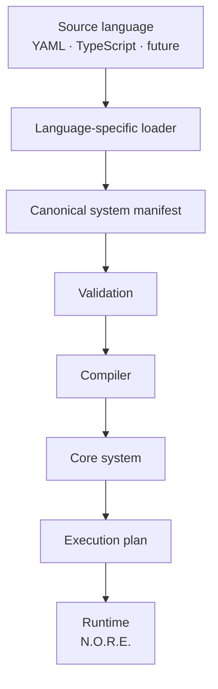
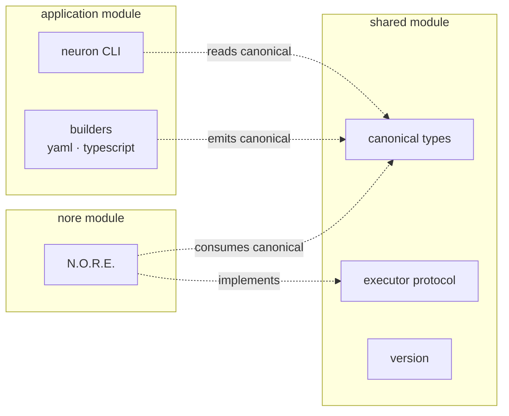
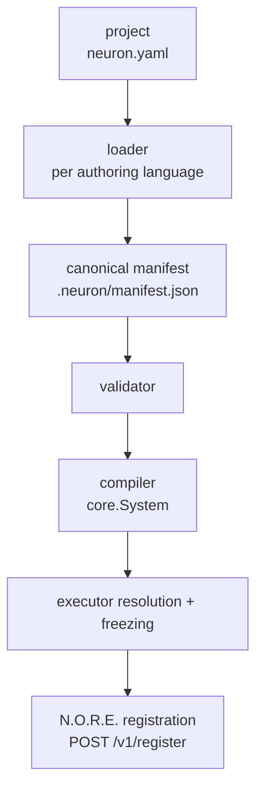
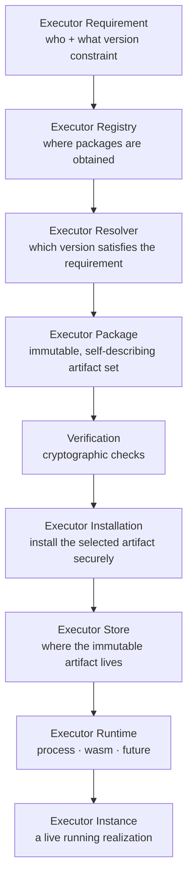
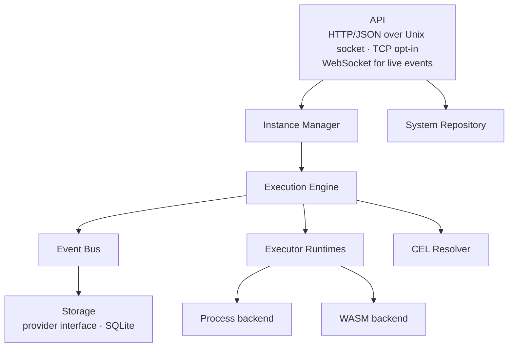
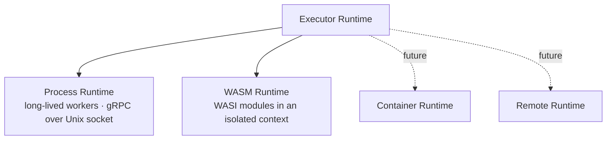

# Architecture

Neuron is a runtime for building and operating complex software systems from composable, executable capabilities. This document describes how the platform is put together: the canonical model everything converges on, the boundaries that must never blur, and the data flow end to end.

> [!TIP]
> Short on time? Read [The core idea](#the-core-idea), [The canonical pipeline](#the-canonical-pipeline), and [What lives where](#what-lives-where).

---

## The core idea

Modern software is composed of applications, services, workers, libraries, queues, databases, APIs, and infrastructure. As systems grow, the hard part stops being any individual component and becomes making all of them work together as one coherent system.

Neuron's answer is to stop making the runtime understand what a component *is* and instead make it understand what a component *does* — and how it connects. Everything executable is a **capability**: described by a contract, reached through a relationship, and operated by a runtime that does not need to know how it is implemented.

> [!IMPORTANT]
> Software should be composed from things that can do something, connected by explicit relationships, and operated by a runtime that does not need to understand what those things are.

This leads to a deliberately small set of primitives:

| Primitive | Responsibility | What it never knows |
| --- | --- | --- |
| **System** | Defines what exists and how it is connected | How capabilities are implemented |
| **Module** | An executable capability packaged for Neuron | The composition it belongs to |
| **Service** | Exposes one executable capability | How the capability is executed |
| **Executor** | Provides the machinery that runs a Service | The composition of the System |
| **Connector** | Defines how two capabilities communicate | The business meaning of the data |
| **Instance** | A living realization of a System | Implementation details of its Services |
| **N.O.R.E.** | Operates registered Systems — instantiate, schedule, execute | What any capability actually means |

The separation between **Service** and **Executor** is the load-bearing wall. It is what lets Neuron host capabilities implemented in any technology without turning the core into a collection of special cases: the Service stays logical, the Executor stays mechanical, and the runtime only ever sees the executor boundary.

---

## Design goals

In priority order:

1. **Correctness** — behavior is defined, bounded, and tested at the right boundary.
2. **Architectural integrity** — one authoritative place for every important domain behavior, no competing models.
3. **Isolation** — source languages never leak into the runtime; the runtime never parses author input.
4. **Security** — external executors are untrusted code and are hosted accordingly.
5. **Performance** — concurrency and worker reuse are first-class, measured, not assumed.
6. **Scalability** — the primitive model composes from one service to distributed systems.
7. **Maintainability** — packages own a single responsibility and are named after it.
8. **Clear public APIs** — the SDK, the executor protocol, and the CLI are contracts.
9. **Testability** — behavior is exercised through stable boundaries.
10. **Documentation** — intent and constraints are explained where they matter.

---

## The canonical pipeline

All authoring surfaces converge on one canonical representation before anything language-, runtime-, or technology-specific happens:



Nothing downstream of the **canonical manifest** knows how a system was authored. YAML systems and TypeScript systems produce the same manifest, compile through the same compiler, and run on the same runtime.

---

## What lives where

The repository is a monorepo organized into strictly separated Go modules:

| Path | Responsibility |
| --- | --- |
| `application/` | The `neuron` CLI — authoring, building, module resolution, client, daemon bootstrap |
| `nore/` | N.O.R.E. — the Neuron Operational Runtime Engine |
| `shared/` | Canonical types, executor contract, version — agreed on by both Go modules |
| `packages/sdk/` | `@neuron/sdk` — TypeScript system-definition language |
| `packages/executor-go/` | Go SDK for authoring Neuron modules (executors) |
| `examples/` | Runnable example systems and reference modules |
| `docs/` | Architecture, getting started, installation, module, and runtime docs |
| `scripts/` | Workspace development and release helpers |

The important fact: `application` and `nore` are **separate Go modules** that only agree through the canonical types and protocol contracts in `shared`. The CLI never reaches into the runtime's internals; the runtime never reads YAML or TypeScript.



The version reported by `neuron version` and `nore --version` comes from a single source, `shared/version`, stamped at build time via `-ldflags`.

---

## System definition

A **System** is a composition of capabilities and the explicit relationships between them. The canonical YAML form mirrors the manifest structure in `examples/ecommerce_order`:

```yaml
# systems/order-processing/system.yaml
apiVersion: neuron/v1
kind: System

metadata:
  name: order-processing
  version: 1.0.0
  description: Order processing pipeline

services:
  - ref: validate-order
    entry: ../../services/validate-order.yaml
  - ref: parse-order
    entry: ../../services/parse-order.yaml

connectors:
  - from: validate-order
    to: parse-order
    mappings:
      - target: validation_data
        expression: "source.output"
    validations:
      - expression: "source.output.valid == true"
        message: "Order validation failed"
```

A **Service** names the logical capability and the module that provides it:

```yaml
# services/validate-order.yaml
apiVersion: neuron/v1
kind: Service

metadata:
  name: validate-order
  version: 1.0.0
  description: Validate incoming order request

spec:
  executor:
    type: neuron:core:set

  config:
    status: validated
    valid: true

  mappings:
    - direction: input
      source: execution.input.order
      target: order

  execution:
    mode: wait
    timeout: 5s
```

Execution flows along the connectors. Each connector defines what data flows between the two services (`mappings`, expressed in CEL) and optionally which conditions must hold (`validations`). Execution input is available to expressions as `execution.input`; the upstream service's output as `source.output`.

---

## Authoring surfaces

### YAML

The YAML surface is the canonical, zero-tooling authoring experience. A project is a directory with `neuron.yaml`, `systems/`, `services/`, and `connectors/`. `neuron init` scaffolds it, and `neuron register` consumes it. See `examples/ecommerce_order` for a complete project.

### TypeScript — the SDK

The TypeScript SDK (`@neuron/sdk`) is the same capability: a typed, always-autocompleted way to describe systems in TypeScript, converging on the same canonical manifest.

```ts
// system.ts
import { Service, System } from "@neuron/sdk";

const validate = Service({
  name: "validate-order",
  version: "1.0.0",
  description: "Validate an incoming order",
})
  .executor({ name: "neuron:core:set" })
  .inputSchema<{ order: object }>()
  .outputSchema<{ order: object; valid: boolean }>();

export default System({
  name: "order-processing",
  version: "1.0.0",
})
  .inputSchema<{ order: object }>()
  .withParams((input) =>
    validate.withInput({ order: input.order })
  )
  .toManifest();
```

The SDK is a **definition tool**. It describes systems; it does not execute them, and it must never become a runtime. The Go side remains responsible for parsing, validating, compiling, and running the canonical representation. See [packages/sdk/README.md](../packages/sdk/README.md).

---

## Building & loading

Each authoring surface has a dedicated loader in `application` (`application/build/yaml`, `application/build/typescript`). A loader's only job is to translate its source language into the **canonical manifest** — plus project-level concerns (paths, variables, entry points).

The pipeline in `neuron register`:



The validator and compiler are language-agnostic: they consume and emit canonical structures. YAML-specific quirks stay inside the YAML loader; TypeScript-specific quirks stay inside the TS loader.

The TypeScript loader delegates the actual build to the SDK CLI (`neuron-sdk build --path <root>`), which resolves the project config (`neuron.config.ts`), executes the entry module, and writes `.neuron/manifest.json` — then the same canonical path continues.

---

## The compiler boundary

The compiler transforms the canonical manifest into the runtime/core structures N.O.R.E. consumes.

> [!WARNING]
> The compiler MUST remain source-language agnostic. It MUST NOT parse YAML or TypeScript, resolve GitHub repositories, download or install executors, launch processes, execute services, own HTTP clients, or contain registry-specific behavior.

Those responsibilities belong to their own layers. The compiler is pure transformation: canonical manifest in, core system out.

---

## The module & executor model

A module is the public word for a capability packaged for Neuron. Within the model, an executor is distilled through a chain of distinct responsibilities:



No two steps merge:

| Step | Answers | Owns |
| --- | --- | --- |
| **Registry** | *Where* | Providers (`github`, `local`, future registries) |
| **Resolver** | *Which* | Best version by semantic versioning, above the providers; prefers already-installed artifacts so running instances stay independent of the network |
| **Installer** | *How* | Verifying and installing the selected package archive |
| **Store** | *Where it lives* | The immutable installed artifact, keyed by name and exact version, under `~/.neuron/executors` |
| **Runtime** | *How it executes* | Spawning, supervising, and terminating executor workers |

The CLI runs this pipeline during `neuron register` and then **freezes** the exact resolved versions into the registration. N.O.R.E. therefore never resolves modules itself — it receives a closed set of resolved executors and launches instances from them.

Built-in modules are the exception that proves the rule: they run in-process inside N.O.R.E., so resolution skips them and the runtime dispatches them directly. See [docs/MODULES.md](./MODULES.md) for the full model.

---

## N.O.R.E. — the runtime engine

**N.O.R.E. (Neuron Operational Runtime Engine)** is the daemon that registers systems, creates instances, executes them, and persists their records.



The runtime boundary inside N.O.R.E. is the **executor runtime** abstraction. One interface, multiple backends:



A backend owns starting the executor, connecting to it, health checking, executing requests, cancellation, deadlines, termination, and restart. The registry, installer, and compiler own none of that.

### Instance lifecycle

A System definition is static. An **Instance** is a living realization with its own state. Instances are created from a registered system, and each creation plans and runs the system across its services:


Instances survive runtime restarts: on startup, N.O.R.E. restores persisted instances and their in-flight executions from storage.

### Safe shutdown

On `SIGINT`/`SIGTERM`, N.O.R.E. closes listeners and **gracefully stops live instances** before exiting, so executor-backed resources (worker processes, WASM modules) receive a clean shutdown.

---

## The executor protocol

The runtime never assumes an executor is written in Go, compiled to WASM, or launched as a process. Executors speak a **stable, language-neutral protocol**:

| Protocol | Transport | Workers |
| --- | --- | --- |
| `neuron/executor-v1` | gRPC (protobuf) | Long-lived workers |
| `neuron/executor-v1-json` | Line-delimited JSON over stdio | One-shot workers |

The gRPC surface is defined in `shared/protocol/executor/v1`. It covers handshake, protocol version, identity, capabilities, initialization, execution, structured input/output/errors, cancellation, deadlines, and health. For a simple one-shot module, the JSON variant keeps the barrier to entry at "read a line, write a line."

The transport detail lives behind the executor runtime abstraction, which is why the same logical module can be hosted as a process or as WASM without the rest of the system caring. Authoring an executor is covered by the Go SDK in `packages/executor-go`; a reference module is shipped in `examples/executors/echo`, compiled for both runtimes from the same source.

---

## Persistence

N.O.R.E. persists registered systems, instances, executions, and the event log through a small storage provider interface (`storage.Store`), implemented today by SQLite under the configured data directory (`~/.neuron/nore`).

Executions are kept in a memory-backed store that mirrors records into persistent storage, so live executions are fully in-memory for speed and durable for recovery. On restart, N.O.R.E. restores persisted instances and their in-flight executions.

Execution history and retention are intended to become a **configurable storage policy** (`none | memory | local`) so retention is an operational choice rather than a fixed behavior — and so execution semantics never depend on persistent storage being enabled. The pluggable store is in place; the policy is tracked in [TODO.md](../TODO.md).

---

## Security & isolation

- **Default transport is local.** N.O.R.E. listens on a Unix socket (mode `0600`) owned by the local user. TCP is opt-in and the API is unauthenticated — exposing it over an untrusted network is unsupported.
- **External executors are untrusted.** They are verified by digest before install, hosted out-of-process, and never loaded into the N.O.R.E. address space (with the deliberate exception of modules shipped as part of N.O.R.E. itself).
- **Capabilities are metadata, not permissions.** A module manifest may declare capabilities; the runtime enforces actual permissions at the execution boundary.
- **GitHub is a distribution source, not a security boundary.** Release artifacts are verified by digest before installation.

---

## Performance principles

- Concurrency is bounded by an executor worker pool; long-lived workers are reused across requests rather than respawned per call.
- Resolution prefers already-installed artifacts, so instance execution stays local and offline once modules are in the store.
- Optimization follows measurement, not assumption — see [docs/RUNTIME.md](./RUNTIME.md).

> [!NOTE]
> Do not prematurely introduce distributed infrastructure; the local model is the base case, and distribution is an explicit, incremental option.

---

## Related

| | |
| --- | --- |
| **Modules & executors** | The unified module model in detail — [docs/MODULES.md](./MODULES.md) |
| **Runtime deep dive** | The runtime execution model (maintainer-focused) — [docs/RUNTIME.md](./RUNTIME.md) |
| **CLI** | The `neuron` CLI — [application/README.md](../application/README.md) |
| **Runtime engine** | N.O.R.E. reference (maintainer-focused) — [nore/README.md](../nore/README.md) |
| **TypeScript SDK** | The system-definition language — [packages/sdk/README.md](../packages/sdk/README.md) |
| **Getting started** | Build and run your first system — [docs/GETTING_STARTED.md](./GETTING_STARTED.md) |