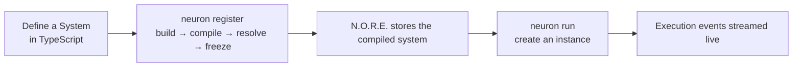
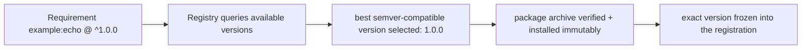

# Getting Started with Neuron

This guide takes you from a fresh checkout to a running system in about fifteen minutes — authored in **TypeScript with `@neuron/sdk`**, registered with the runtime, and executed with live event streaming. No prior Neuron knowledge is assumed: building, validation, compilation, module resolution, and starting the runtime engine are all automatic.



## Prerequisites

- **The `neuron` binary** on your `PATH` (install from a [release](https://github.com/Muhammad-Jay/neuron/releases) or build from source — see [INSTALLATION.md](./INSTALLATION.md)).
- **The repository checked out**, to access the shipped example and the SDK workspace:

  ```bash
  git clone https://github.com/Muhammad-Jay/neuron.git
  cd neuron
  ```

- **Go, pnpm, and Node.js** for the walkthrough only if you build the examples and SDK from source:

  ```bash
  # link the workspace and build @neuron/sdk (produces the neuron-sdk CLI)
  pnpm install
  pnpm build:sdk
  ```

  No daemon setup is required. The runtime engine (N.O.R.E.) is started and stopped for you by the CLI.

---

## Part 1 — Run a shipped example

The repository ships an order-processing pipeline defined entirely in TypeScript (`examples/ecommerce_order_ts`). It uses only built-in modules — capabilities that run in-process inside N.O.R.E. — so it needs zero configuration beyond the SDK.

```bash
cd examples/ecommerce_order_ts
neuron register
```

`neuron register` runs the whole authoring pipeline in one step:

| Step | What happens |
| --- | --- |
| **Build** | The TypeScript system is compiled into the canonical manifest (`.neuron/manifest.json`) |
| **Compile** | The manifest is compiled into a runtime system representation |
| **Resolve** | Module references are resolved. Built-in modules (`neuron:core:set`) are skipped — they run inside the runtime engine |
| **Register** | The compiled system is handed to N.O.R.E., which persists it and returns a system key |

The output ends with a registration key:

```text
order-processing-ts@2.0.0#<key>:development
```

> N.O.R.E. was started automatically. You never start or stop it yourself.

Now run it. The system expects a typed input of `{ order: {...} }`, so pass one explicitly:

```bash
neuron run --input '{"order":{"id":"ord_1001","customerId":"cus_42","customerEmail":"ada@acme.io","currency":"USD","total":4250,"items":[{"sku":"SKU-AG-1","name":"Wireless Mouse","qty":1,"priceCents":4250}],"shippingAddress":{"street":"1 Market St","city":"San Francisco","zip":"94105"}}}'
```

The CLI asks N.O.R.E. to create an instance and execute the system, streaming live execution events:

```text
execution.started       instance created
service.started         validate-order
service.completed       validate-order
service.started         parse-order
service.completed       parse-order
...
execution.completed     status: completed
```

The command returns when execution reaches a terminal state (`execution.completed`, `execution.failed`, or `execution.cancelled`).

Look at what you just ran:

```text
examples/ecommerce_order_ts/
├── system.ts          the System: identity + input schema + composition
├── pipeline.ts        the composition: how services chain and guard
├── services/          each Service: identity, executor, contracts
└── types.ts           the shared domain types (Order, OrderItem, ...)
```

The whole definition is plain TypeScript — types are checked, mappings are verified, and the manifest is derived from the composition.

---

## Part 2 — Author your own system in TypeScript

### Create the project

```bash
neuron init my-first-system
```

`neuron init` creates the directory and a starter `neuron.config.yaml`. Move it under `examples/` so the pnpm workspace picks it up for the SDK:

```bash
mv my-first-system examples/my-first-system
cd examples/my-first-system
```

Open `neuron.config.yaml` and switch the authoring language to TypeScript:

```yaml
lang: typescript
```

The project configuration (`neuron.config.json` | `neuron.config.yaml` | `neuron.config.yml`) is the single source of truth for how the project is authored and run. `init` defaults to the YAML authoring surface; setting `lang: typescript` and pointing `entry` at a `.ts` file selects the SDK.

### Add the TypeScript layout

Create the SDK project files:

```text
examples/my-first-system/
├── neuron.config.yaml     ← config: lang, entry, runtime
├── package.json         ← declares @neuron/sdk
├── system.ts            ← the System definition (the entry)
└── types.ts             ← domain types
```

`package.json`:

```json
{
  "name": "my-first-system",
  "version": "0.1.0",
  "private": true,
  "type": "module",
  "dependencies": {
    "@neuron/sdk": "workspace:*"
  }
}
```

### Define the capability

A **Service** is a named unit of work with an identity, an executor, and typed contracts:

```ts
// types.ts
export interface Order {
  id: string;
  customerId: string;
  customerEmail: string;
  currency: string;
  total: number;
  items: { sku: string; name: string; qty: number; priceCents: number }[];
  shippingAddress: { street: string; city: string; zip: string };
}

// system.ts
import { Service, System } from "@neuron/sdk";
import type { Order } from "./types";

const validateOrder = Service({
  name: "order.validate",
  version: "1.0.0",
  description: "Validate an incoming order",
})
  .executor({ name: "neuron:core:set" })
  .inputSchema<{ order: Order }>()
  .outputSchema<{ order: Order }>();

const authorizePayment = Service({
  name: "payment.authorize",
  version: "1.0.0",
  description: "Authorize payment for an order",
})
  .executor({ name: "neuron:core:set" })
  .inputSchema<{ order: Order; amount: number }>()
  .outputSchema<{ order: Order; amount: number }>();
```

### Compose the system

`System` defines the pipeline: bind system input to the first service with `.withParams()`, chain with `.next()`, and map outputs into the next input with `.withInput()`:

```ts
const manifest = System({
  name: "my-first-system",
  version: "1.0.0",
  description: "Validate and authorize customer orders",
})
  .inputSchema<{ order: Order }>()
  .withParams((input) =>
    validateOrder
      .withInput({ order: input.order })
      .next(
        authorizePayment.withInput({
          order: validateOrder.output.order,
          amount: input.order.total,
        })
      )
  )
  .toManifest();

export default manifest;
```

Point the project configuration at the entry file (it must default-export the manifest):

```yaml
# neuron.config.yaml
lang: typescript
entry: system.ts
```

> [!NOTE]
> `withParams(input => ...)` binds the system's execution input (typed by `inputSchema`) into the first service. `.next()` wires one service to the next; `.withInput()` maps fields — every binding is type-checked against the target's input contract.

### Register and run

```bash
# from the repository root, link the workspace packages
pnpm install
pnpm build:sdk

cd examples/my-first-system
neuron register
neuron run --input '{"order":{"id":"ord_2001","customerId":"cus_7","customerEmail":"grace@acme.io","currency":"EUR","total":2250,"items":[{"sku":"SKU-RG-2","name":"Keyboard","qty":1,"priceCents":2250}],"shippingAddress":{"street":"2 Rue de Paris","city":"Lyon","zip":"69002"}}}'
```

Watch the events stream:

```text
execution.started       instance created
service.started         order.validate
service.completed       order.validate
service.started         payment.authorize
service.completed       payment.authorize
execution.completed     status: completed
```

### Inspect what is running

Your instance has real state in the runtime:

```bash
neuron instance list            # list instances
neuron instance list --all      # include inactive ones
neuron instance remove <id>     # remove one instance
neuron instance clear           # remove everything
```

---

## Part 3 — Use an external module

Built-in modules cover simple cases. Real systems also use **external modules (executors)** — capabilities authored, packaged, and distributed independently. This part runs the full external-module lifecycle against the repository's reference `echo` module.

### Build the reference module

The echo module is compiled from one Go source (`examples/executors/echo`) into both a native process binary and a WebAssembly module. Build it into a local registry catalog:

```bash
cd examples/executors
./build.sh
```

This produces `examples/executors/catalog/`, containing for each module version:

```text
catalog/example/echo/1.0.0/
    executor.json                              module manifest
    echo                                       native binary (process runtime)
    example-echo-1.0.0-executor.neuron.tar.gz  canonical package archive
```

`executor.json` declares identity, runtime type, protocol, and platform artifacts.

### Register the catalog as a local registry

Add a `local` registry in your project's `neuron.config.yaml`:

```yaml
executors:
  registries:
    - name: local
      url: /absolute/path/to/neuron/examples/executors/catalog
```

The `local` registry is directory-backed and served offline. Additional registries (such as `github`) are declared the same way and are opted in explicitly — with no `executors.registries` block, only built-in executors are available.

### Require the module from a service

Add an echo service to your system and chain it at the end:

```ts
// system.ts
const echo = Service({
  name: "echo",
  version: "1.0.0",
  description: "Echo a message through the reference module",
})
  .executor({ name: "example:echo", version: "^1.0.0", registry: "local" })
  .inputSchema<{ message: string }>();
```

Wire it into the pipeline — the system input remains `{ order: ... }`:

```ts
withParams((input) =>
  validateOrder
    .withInput({ order: input.order })
    .next(
      authorizePayment.withInput({
        order: validateOrder.output.order,
        amount: input.order.total,
      })
    )
    .next(
      echo.withInput({
        message: input.order.customerEmail,
      })
    )
)
```

> [!NOTE]
> `registry: "local"` tells the resolver to source `example:echo@^1.0.0` from the local catalog. Omit `registry` and the default `local` registry is used; a `github` registry requires an explicit catalog configuration.

### Resolve, install, run

```bash
cd examples/my-first-system
neuron register
```

During registration Neuron resolves `example:echo@^1.0.0`:



1. the registry is queried for available versions (here: `1.0.0`);
2. the best satisfying version is selected with semantic versioning;
3. the canonical package archive is downloaded, verified, and installed immutably into the executor store (`~/.neuron/executors`);
4. the exact version is frozen into your registration — running an instance needs no further resolution, and works offline.

You can manage the module directly:

```bash
neuron add example:echo@^1.0.0      # resolve + install into the store
neuron executor list                # installed modules
neuron executor inspect example:echo@1.0.0
neuron remove example:echo@1.0.0
```

Now run:

```bash
neuron run --input '{"order":{"id":"ord_3001","customerId":"cus_11","customerEmail":"leo@acme.io","currency":"USD","total":1900,"items":[{"sku":"SKU-WB-3","name":"Webcam","qty":1,"priceCents":1900}],"shippingAddress":{"street":"3 King St","city":"London","zip":"EC2A 4BX"}}}'
```

The execution launches the installed module **out-of-process**, passes your input through the executor protocol, and streams the events back.

---

## Next steps

| | |
| --- | --- |
| **TypeScript SDK** | Every SDK feature in depth — [packages/sdk/README.md](../packages/sdk/README.md) |
| **Modules & executors** | The unified module model, packaging, and authoring — [docs/MODULES.md](./MODULES.md) |
| **Architecture** | How the platform is put together — [docs/ARCHITECTURE.md](./ARCHITECTURE.md) |
| **CLI reference** | Every `neuron` command and flag — [application/README.md](../application/README.md) |
| **Status** | What is available, experimental, and planned — [docs/STATUS.md](./STATUS.md) |