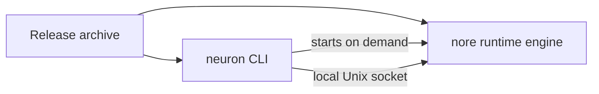

# Installation

**One product, one binary.** The `neuron` CLI and the N.O.R.E. runtime engine ship together in a single archive. You install `neuron`, and the CLI locates and starts the bundled runtime engine for you — there is nothing else to install, start, or maintain.



---

## Supported platforms

Release archives are published for the following platforms:

| Platform | Architectures |
| --- | --- |
| Linux | `amd64`, `arm64` |
| macOS | `amd64`, `arm64` |
| Windows | `amd64` |

Each archive contains both the `neuron` CLI and the `nore` runtime engine. On every platform the product is used the same way: you invoke `neuron`, and the CLI runs the engine.

---

## Option 1 — Install an official release

### 1. Download the archive

Go to the [releases page](https://github.com/Muhammad-Jay/neuron/releases) and download the archive for your operating system and architecture:

```text
neuron-0.1.0-linux-amd64.tar.gz
neuron-0.1.0-linux-arm64.tar.gz
neuron-0.1.0-darwin-amd64.tar.gz
neuron-0.1.0-darwin-arm64.tar.gz
neuron-0.1.0-windows-amd64.zip
```

Every release also publishes `SHA256SUMS`, the expected cryptographic digests for every archive.

> [!IMPORTANT]
> Verify the archive checksum **before extracting**. See [Verifying the installation](#verifying-the-installation).

Prefer the latest release to keep up to date.

### 2. Extract the archive

The archive contains a single folder, `neuron/`, holding the product binaries.

**Linux / macOS (terminal):**

```bash
tar -xzf neuron-0.1.0-linux-amd64.tar.gz
```

**Windows (PowerShell):**

```powershell
Expand-Archive .\neuron-0.1.0-windows-amd64.zip -DestinationPath .
```

### 3. Put `neuron` on your PATH

Inside the `neuron/` folder you will find the `neuron` executable. Move or link it somewhere on your `PATH`:

```bash
sudo mv neuron/neuron /usr/local/bin/neuron
```

On Windows, add the extracted folder to your `PATH` environment variable, or move `neuron.exe` into a directory already on your `PATH`.

> [!TIP]
> Keep the `nore` binary next to `neuron` in the same directory. When the runtime engine is not found on the system `PATH`, the CLI falls back to a `nore` executable sitting beside itself — which is exactly the layout the release archive ships.

### 4. Verify

```bash
neuron version
```

That is the entire install. There is no daemon to configure, no service to start, and no environment to initialize — the runtime engine ships with the CLI and is started on demand.

---

## Option 2 — Build from source

Building from source is only necessary when contributing, testing unreleased changes, or packaging a custom build.

### Prerequisites

- Go `1.26.5` or newer.
- Node.js — only needed for the TypeScript SDK, not required to build the CLI.

### Clone and build

```bash
git clone https://github.com/Muhammad-Jay/neuron.git
cd neuron
go build -o neuron ./application/cmd/neuron
```

`application` and `nore` are separate Go modules in a workspace; the command above builds the CLI from within the workspace. The CLI locates the runtime engine by falling back to a `nore` executable in its own directory, a `nore` build inside the source tree, or the system `PATH`; you can pin a specific runtime with `--nore-path` or `daemon.norePath`.

Install the built binary wherever you keep executables:

```bash
sudo mv neuron /usr/local/bin/neuron
```

### Build the runtime engine separately

The CLI and the runtime are separate binaries. To build both for development:

```bash
go build -o neuron ./application/cmd/neuron
go build -o nore ./nore/cmd/nore
```

### Version stamping

Local builds report the development version (`dev`). Official releases stamp the release version into the binary:

```bash
go build -ldflags "-X github.com/Muhammad-Jay/neuron/shared/version.Version=v0.1.0" \
  -o neuron ./application/cmd/neuron
```

See [scripts/release.sh](../scripts/release.sh) for the release build.

---

## Verifying the installation

### Check the version

```bash
neuron version
# e.g. neuron 0.1.0
```

### Verify the archive checksum

Compare the SHA-256 digest you compute locally with the one published in `SHA256SUMS`.

**Linux / macOS:**

```bash
shasum -a 256 neuron-0.1.0-linux-amd64.tar.gz
```

**Windows (PowerShell):**

```powershell
Get-FileHash .\neuron-0.1.0-windows-amd64.zip -Algorithm SHA256
```

The digest shown must match the published value exactly.

### Smoke-test the full flow

```bash
cd examples/ecommerce_order_ts
neuron register
neuron run
```

> [!NOTE]
> Requires the repository checkout and the TypeScript SDK build (`pnpm install && pnpm build:sdk`); see [docs/GETTING_STARTED.md](./GETTING_STARTED.md) for the complete walkthrough. A working install produces live execution events from `neuron run`.

---

## Uninstalling

Remove the binary from your PATH:

```bash
sudo rm /usr/local/bin/neuron
```

If you want to remove local state created by the CLI and the runtime (registered systems, instances, installed modules, and the daemon socket/data), delete the Neuron directory under your home folder:

```bash
rm -r ~/.neuron
```

> [!WARNING]
> Removing `~/.neuron` destroys installed modules, registered systems, and execution history. Do it only if you really want a clean slate.

---

## System requirements

- A 64-bit operating system from the [supported table](#supported-platforms).
- Disk space for the binaries (tens of megabytes) plus whatever space registered systems, installed modules, and execution records occupy under `~/.neuron`.
- On Linux, the executable bit must be set (true after extraction from a release archive).

External modules are hosted out-of-process by the runtime; executing them has the same system requirements as the module's own platform target.

---

## Notes for Linux users

Release archives are built for glibc-based Linux distributions (`amd64` and `arm64`). If you are on a minimal distribution, verify the runtime engine starts as part of the [smoke test](#smoke-test-the-full-flow).

---

## Troubleshooting

<details>
<summary><strong>`neuron: command not found`</strong></summary>

The binary is not on your `PATH`. Move it onto the `PATH` as in [step 3](#3-put-neuron-on-your-path), then log out and back in or reopen the terminal.

</details>

<details>
<summary><strong>`neuron version` prints nothing / errors</strong></summary>

The binary may be for a different platform, or the archive was extracted partially. Verify the checksum and that you are executing the matching platform build.

</details>

<details>
<summary><strong>Registration fails when the walkthrough references an external module</strong></summary>

External modules must be resolvable through a configured registry. The shipped examples use only built-in modules and need no registry. See [docs/MODULES.md](./MODULES.md) for configuring registries.

</details>

<details>
<summary><strong>The runtime engine cannot be found</strong></summary>

The CLI looks for the `nore` runtime binary beside itself, then in the source tree, then on the system `PATH`. If none is found it reports `nore runtime not found`. Set `daemon.norePath` in config or pass `--nore-path <path>` to point at the runtime binary explicitly.

</details>

<details>
<summary><strong>A stale daemon socket</strong></summary>

If a previous CLI run was killed unusually and `neuron` reports a socket error, remove the stale socket file:

```bash
rm ~/.neuron/nore.sock
```

The CLI recreates it on the next run.

</details>

---

## Related

| | |
| --- | --- |
| **Getting started** | The full run-through — [docs/GETTING_STARTED.md](./GETTING_STARTED.md) |
| **CLI reference** | Every `neuron` command and flag — [application/README.md](../application/README.md) |
| **Modules & executors** | The unified module model — [docs/MODULES.md](./MODULES.md) |
| **Status** | What is supported in this version — [docs/STATUS.md](./STATUS.md) |