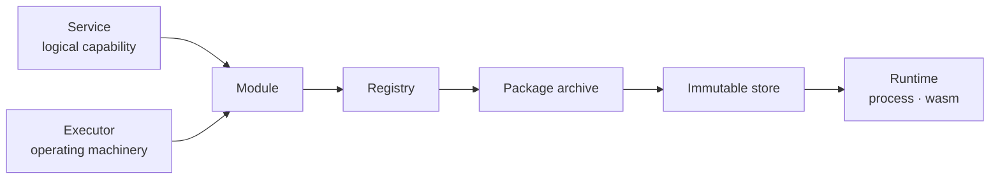
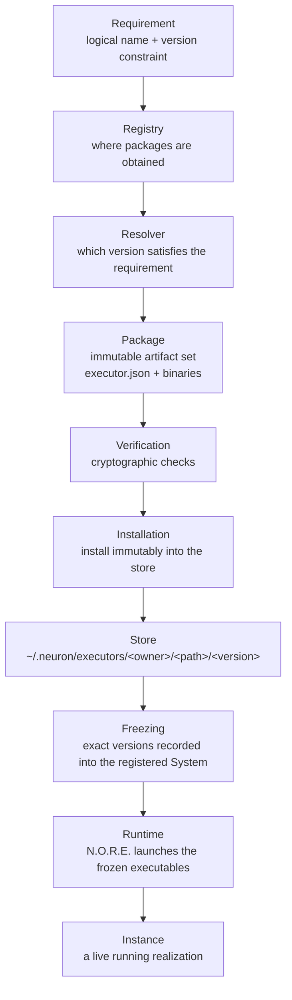
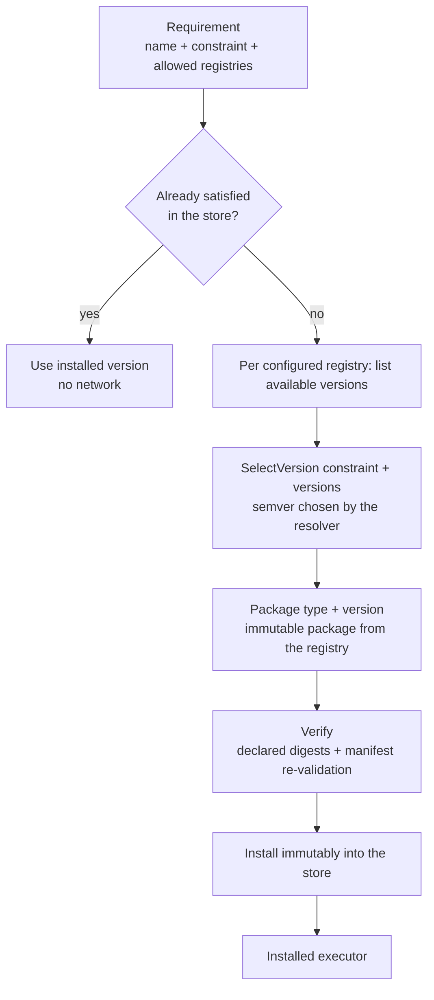

# Modules & Executors

**The unified module model in Neuron** — what a module is, how one is named, packaged, resolved, installed, frozen, and executed, and how to author one yourself.

Modules are the executable spine of Neuron. A **Service** is the logical capability; an **Executor** is the machinery that makes it operate. Both travel together as a **module** — one named, immutable, distributable unit.



> [!NOTE]
> Whether a capability is a logical operation or the machinery that executes it, to every other part of Neuron it is a module: something with a name, a contract, and a way to be run.

---

## The two module families

| Family | Hosting | Resolution | Examples |
| --- | --- | --- | --- |
| **Built-in modules** | In-process inside N.O.R.E. | Never resolved or installed | `neuron:core:set` |
| **External modules** | Out-of-process by N.O.R.E. | Resolved, verified, installed by the CLI | `example:echo`, `Muhammad-Jay:github:read` |

This document is about the second family.

---

## The module lifecycle

Each stage is a separate responsibility with its own package. The registry only answers *where*; the resolver only answers *which*; the installer only answers *how*; the store only owns *where the artifact lives*; the runtime only owns *how the artifact executes*.



---

## Naming modules

A module is referenced by a logical name: a `:`-separated path whose first segment is the **owner** and whose remaining segments are the functional path.

| Logical name | Owner | Path |
| --- | --- | --- |
| `example:echo` | `example` | `echo` |
| `github:read` | `github` | `read` |
| `Muhammad-Jay:github:read` | `Muhammad-Jay` | `github`, `read` |

The owner is always the first segment; at least one functional segment must follow. The same logical name is used everywhere in the authoring surface — in a Service's executor requirement, on the `neuron add` command line, and in the executor manifest's `metadata.name`.

The GitHub registry interprets a logical name as `owner/repo`, hyphen-joining the trailing path segments (`Muhammad-Jay:github:read` → `Muhammad-Jay/github-read`). The local store keeps the `:` delimiters as directory separators, so related modules stay grouped by owner.

---

## Requirements & version selection

A module **requirement** is a logical name plus an optional version constraint:

| Form | Meaning |
| --- | --- |
| `example:echo` | Any version — the latest satisfying version is chosen |
| `example:echo@1.0.0` | Exact version pin |
| `example:echo@^1.0.0` | Any compatible `1.x` |
| `example:echo@~1.0.0` | Any `1.0.x` |
| `example:echo@>=1.0.0, <2.0.0` | Explicit range |

Semver governs selection (via `Masterminds/semver/v3`). Selection is performed by the **resolver above the providers** — the registry never decides compatibility. The rules:

1. If an exact pin is already installed, it is used directly — no network.
2. If a constraint is satisfied by an already-installed version, the best installed version is used — no network.
3. Otherwise the registries are consulted; the best version satisfying the requirement is selected, packaged, and installed.

A floating requirement (no version) always talks to the registries so "latest" is what the registry says is newest — never a stale local version.

---

## The executor contract

Every external module is described by a single manifest file, `executor.json`, at the root of its package:

```json
{
  "apiVersion": "neuron/v1",
  "kind": "Executor",
  "metadata": {
    "name": "example:echo",
    "version": "1.0.0",
    "description": "Echoes the execution input."
  },
  "runtime": {
    "type": "process",
    "entrypoint": "echo",
    "protocol": "neuron/executor-v1-json"
  },
  "services": ["example:echo"],
  "capabilities": [],
  "platforms": {
    "linux-amd64": { "artifact": "echo" }
  }
}
```

The manifest answers three questions:

| Field | Answers |
| --- | --- |
| `metadata.name` / `metadata.version` | What IS this artifact? Identity, certified by the manifest in the package |
| `runtime.type` / `runtime.entrypoint` / `runtime.protocol` | How is it launched and how do we talk to it? |
| `platforms` | Which artifact backs which execution boundary? |

Validation is strict:

- `apiVersion` must be `neuron/v1` and `kind` must be `Executor`.
- `metadata.name`, `metadata.version`, `runtime.type`, `runtime.entrypoint`, and at least one `services` entry are required.
- `capabilities` is an opt-in declaration list — an empty list declares nothing. Capabilities are metadata that describe what a module *claims*; actual permissions are enforced by the runtime, never inferred from the manifest.

### Runtime types

| `runtime.type` | Meaning | Status |
| --- | --- | --- |
| `process` | Runs the entrypoint as an OS child process | Supported |
| `wasm` | Runs the entrypoint inside an embedded WASI runtime | Supported |
| `container` | Runs the entrypoint inside an OCI container | Planned |
| `remote` | Runs the entrypoint on a remote executor host | Planned |

### Platform keys & artifacts

Each entry of `platforms` maps an execution boundary to its artifact:

- Native process artifacts use host platform keys of the form `GOOS-GOARCH` (for example `linux-amd64`, `darwin-arm64`, `windows-amd64`).
- WASM artifacts use the portable key `wasm32-wasi`, because a WASI module runs on any host.

`runtime.entrypoint` is the executable/module location relative to the installed package root. `platforms.<key>.artifact` is the binary or archive file name for that platform. When an artifact is distributed as a release asset, `platforms.<key>.sha256` should declare its digest so installation can verify it (a digest is verified whenever one is declared).

---

## Package archives

The canonical distribution unit is the **executor package archive**:

```text
<name>-<version>-executor.neuron.tar.gz
```

For example, `example-echo-1.0.0-executor.neuron.tar.gz`. The archive is a single immutable artifact containing, at its root:

```text
executor.json
<artifact>          (per-platform binaries referenced by the manifest, as packaged)
```

The `executor.json` inside the archive is **authoritative** for identity and content. Registries prefer archives over per-platform assets because one asset carries the manifest plus every platform binary it references.

> [!TIP]
> An archive is constructed and staged externally, then published through a registry. In this repository, `examples/executors/build.sh` produces the archive for the reference module. Installing from an archive extracts it, re-validates the manifest, verifies declared digests, and writes an installation record.

---

## Registries

A **registry** is a provider that answers *where a package can be obtained*. It is deliberately pluggable; the resolver and runtime never know or care which registry a package came from.

| Registry | Backing | Serve |
| --- | --- | --- |
| `github` | GitHub Releases | Version discovery via releases; artifacts as release assets |
| `local` | A directory path | A directory-backed catalog for offline development and tests |

The `github` registry resolves a logical name like `example:echo` to a repository (`example/echo`), discovers versions from release tags, and reads `executor.json` from a release asset. The GitHub registry is **catalog-driven**: only modules listed in its configured catalog are served — it never guesses at repositories.

The `local` registry serves a directory laid out exactly like the installed store:

```text
<root>/example/echo/1.0.0/
    executor.json
    example-echo-1.0.0-executor.neuron.tar.gz
```

It exists so the full resolution → selection → packaging → installation pipeline works offline and in tests, and it demonstrates that registries are pluggable — "local" is just another provider.

Configure registries per project in `neuron.config.yaml` (or `neuron.config.json` / `neuron.config.yml`):

```yaml
executors:
  registries:
    - name: local
      url: /absolute/path/to/catalog
    - name: github
      url: https://api.github.com
```

With no `executors.registries` block, only built-in executors are available. Requirements without an explicit `registry` fall back to the default local registry automatically; `github` and any other registry must be declared here to be used.

---

## Resolution & installation

Resolution is performed by the CLI during `neuron add` and `neuron build`:



Installation is atomic: artifacts are staged, verified, and reconciled against the inner manifest before the final immutable record is written (`install.json`). The installed layout mirrors the logical name:

```text
~/.neuron/executors/example/echo/1.0.0/
    executor.json
    install.json
    echo
```

You manage the store directly:

```bash
neuron add example:echo@^1.0.0              # resolve + install
neuron executor list                        # everything installed
neuron executor list --type process         # filtered by runtime type
neuron executor inspect example:echo@1.0.0  # detail for one installed module
neuron remove example:echo@1.0.0            # uninstall
```

---

## Freezing into registered systems

When you `neuron build` a system that references external modules, the CLI resolves every requirement and records the **exact** resolved version, artifact digest, and launch details into the registration payload handed to N.O.R.E.

The runtime therefore never resolves anything — it receives a closed set of frozen executors and launches instances from them. This gives three guarantees:

1. The runtime stays independent of registries and the network.
2. A registered system is reproducible: it runs exactly the modules that were resolved at registration time.
3. Re-running a registered system never silently picks a different version.

---

## Executing installed modules

N.O.R.E. hosts external modules out-of-process. The runtime dispatches on `runtime.type`:

- **Process runtime** — a native worker process, launched per instance from the frozen entrypoint, kept alive and reused across requests, health-checked, cancellation/deadline-aware, and gracefully terminated. See [docs/RUNTIME_PROCESS.md](./RUNTIME_PROCESS.md).
- **WASM runtime** — a WASI module loaded into an embedded, sandboxed runtime, with a fresh module instance per request. See [docs/RUNTIME_WASM.md](./RUNTIME_WASM.md).

The runtime never assumes an implementation language. The contract is the frozen resolved-executor record (runtime type, protocol, entrypoint, exact version) plus the declared wire protocol.

---

## Wire protocols

The backbone of the executor boundary is a stable, language-neutral wire protocol. Two are defined today:

### `neuron/executor-v1` — gRPC

The canonical protocol for **long-lived** executors. Spoken over gRPC (protobuf) on a Unix domain socket, so the transport is local and authenticated by filesystem permissions. The service definition lives in `shared/protocol/executor/v1` and covers identity, capabilities, initialization, execution, structured input/output/errors, cancellation, deadlines, and health. The process runtime uses it for durable, reusable workers.

### `neuron/executor-v1-json` — one-shot JSON over stdio

The simplest possible contract, ideal for small or one-shot modules and for WASM (WASI has no socket interface).

- The runtime writes **one JSON document** to the executor's stdin.
- The executor writes **one JSON document** to stdout and exits zero on success.

Request:

```json
{ "input": { "message": "hello" } }
```

Response:

```json
{ "output": { "message": "hello" } }
```

A controlled failure can be reported in-band (`"error": "..."`, possibly with exit zero); the runtime treats a non-empty `error` as an execution failure and surfaces it downstream.

The runtime also injects execution context as environment variables, so an executor can observe which protocol version, logical type, and exact version it is being run as:

| Variable | Meaning |
| --- | --- |
| `NEURON_EXECUTOR_PROTOCOL` | Expected protocol version |
| `NEURON_EXECUTOR_TYPE` | Logical executor type being executed |
| `NEURON_EXECUTOR_VERSION` | Exact resolved version |

---

## Authoring a module

Authoring an external module means producing a directory that satisfies the executor contract and then distributing it through a registry. There is no constraint on the language — only on the protocol.

### The easy path — the Go SDK

The Go SDK (`packages/executor-go`) removes the protocol plumbing. Write a `Handler`, call `executor.Serve`, and you have an executor:

```go
package main

import (
	"context"
	"log"

	"github.com/Muhammad-Jay/neuron/packages/executor-go"
	shadexec "github.com/Muhammad-Jay/neuron/shared/types/executor"
)

func main() {
	if err := executor.Serve(executor.Handler{
		Initialize: func(ctx context.Context, protocol string, metadata map[string]string) (*executor.InitializeResult, error) {
			return &executor.InitializeResult{ProtocolVersion: shadexec.ProtocolV1}, nil
		},
		Execute: func(ctx context.Context, in map[string]any) (map[string]any, error) {
			return in, nil
		},
	}); err != nil {
		log.Fatal(err)
	}
}
```

The SDK supports both transports and handles marshalling, environment, and protocol details. See [packages/executor-go/README.md](../packages/executor-go/README.md).

Authors with .NET can use the [.NET SDK](../packages/executor-dotnet/README.md) (`Neuron.Executor`). It implements the same `Handler` contract and the `neuron/executor-v1` gRPC transport with the same failure semantics (required `Initialize`/`Execute`, optional `Health`/`Shutdown`, controlled execution errors), and references the same canonical proto from `shared/protocol/executor/v1/executor.proto`.

### The reference module

`examples/executors/echo` is a complete reference module — one Go source compiled for both the process runtime (a native binary) and the WASM runtime (a WASI module), packaged with `executor.json` and the canonical archive by `examples/executors/build.sh`:

```bash
cd examples/executors
./build.sh
```

The build produces:

```text
catalog/example/echo/1.0.0/
    executor.json
    echo                                        (process runtime)
    example-echo-1.0.0-executor.neuron.tar.gz   (archived package)
catalog/example/echo-wasm/1.0.0/
    executor.json
    echo.wasm                                   (wasm runtime)
    example-echo-wasm-1.0.0-executor.neuron.tar.gz
```

Point a `local` registry at the catalog and any system can resolve, install, and run it offline:

```bash
neuron add example:echo@^1.0.0
neuron executor inspect example:echo@1.0.0
```

### Minimal requirements for any module

1. A valid `executor.json` (`apiVersion: neuron/v1`, `kind: Executor`, complete metadata, runtime, services, platforms).
2. The entrypoint artifact reachable through the declared runtime type on a declared platform.
3. Correct protocol behavior — either a gRPC `neuron/executor-v1` service or a one-shot `neuron/executor-v1-json` responder.
4. Distribution through a registry the system can be configured with (currently GitHub Releases or a local catalog).

---

## Built-in modules

N.O.R.E. ships a small set of built-in modules for common operations. They run **in-process** inside the runtime engine and require no resolution or installation — referencing one in a Service is a plain module reference, and the runtime dispatches it directly to the in-process implementation.

> [!IMPORTANT]
> Built-ins are the deliberate exception to out-of-process hosting: they are part of N.O.R.E. itself (and thereby of the trusted, tested runtime). Everything else follows the external-module path above, with verification and process/WASM isolation.

---

## Security model

> [!WARNING]
> External modules are **untrusted code**. Never add an arbitrary module to a registry without verification.

- Artifacts are verified by digest whenever the manifest declares a SHA-256. A digest declaration is not proof of trustworthiness — it proves the artifact is the one the publisher shipped.
- GitHub is a **distribution source, not a security boundary**. A release asset is not automatically trustworthy.
- Hosting is out-of-process; arbitrary external code never runs inside the N.O.R.E. address space.
- Capabilities are metadata. The runtime enforces permissions, never the manifest.

---

## Status

The external-module ecosystem — GitHub-based resolution, catalogs, and published distribution — is **experimental** in this release and may change. The local registry, the archive contract, the manifest schema, and the process/WASM runtimes are stable enough to build and test against today.

See [docs/STATUS.md](./STATUS.md) for the full surface classification.