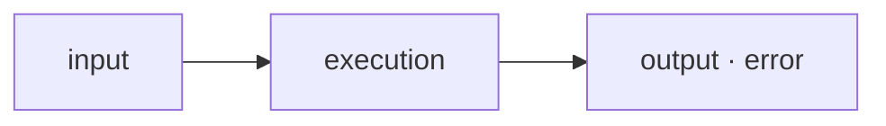
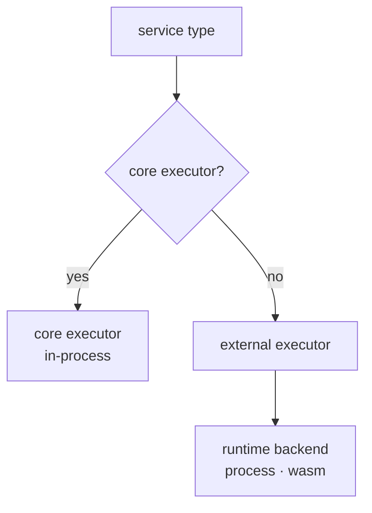
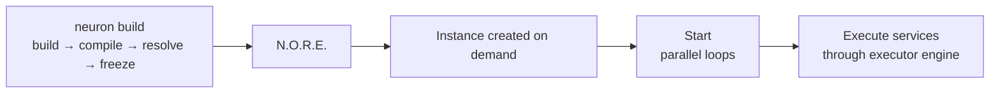
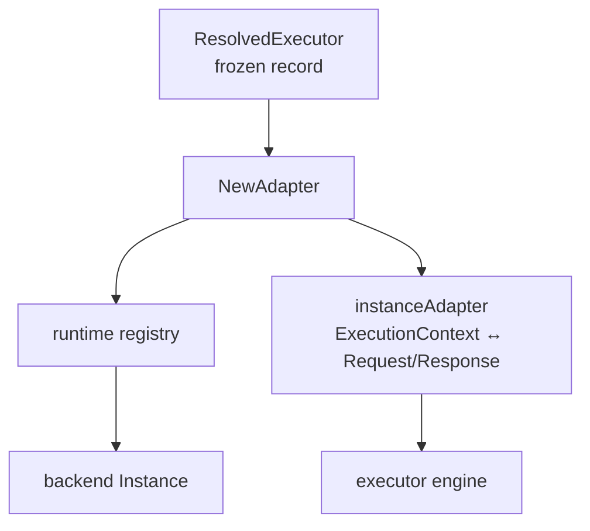

# The N.O.R.E. Runtime

**Maintainer-focused deep dive.** This document describes how N.O.R.E. executes software: the pipeline from an incoming request to a resolved result, the executor contract every capability obeys, the two runtime backends (process and WASM), and how executor authors ship artifacts the runtime can host.

It gives a complete mental model of execution inside N.O.R.E.: what happens at every stage, who owns what, and how a new executor is created and operated.

> [!TIP]
> Prefer the fast path? Read [The execution model](#1-the-execution-model), [The executor contract](#3-the-executor-contract), and [Executing one service](#7-executing-one-service). The two focused docs go deeper: [RUNTIME_PROCESS.md](./RUNTIME_PROCESS.md) and [RUNTIME_WASM.md](./RUNTIME_WASM.md).

---

## 1. The execution model

N.O.R.E. treats every capability as an executor. An execution is always a request/response operation at its core:



The runtime itself does not know what a capability does. It only knows the contract every executor speaks: an input map in, an output map (or a structured error) out. Whatever the capability is — a database query, an HTTP call, a WASM module, a native binary, a remote API — the runtime sees the same shape.

> [!IMPORTANT]
> One System can mix capabilities executed in completely different ways. This is a core property of N.O.R.E.: the System composes capabilities; the runtime hosts them; the executor contract keeps those two independent.

---

## 2. Two kinds of executor

There are two ways a service type gets an executor:

**Core in-process executors.** N.O.R.E. ships built-in executors for common service types. They run inside the N.O.R.E. process and require nothing to be installed, resolved, or launched:

| Service type | Executor |
| --- | --- |
| `set` | Sets static values from config |
| `ai` | In-process mock/placeholder executor |
| `log` | Logs its input |
| `http` | Makes an HTTP request |
| `delay` | Waits a configured interval |
| `command` | Runs an OS command |

They are registered by `RegisterCoreServiceExecutors` in `nore/internal/registry`, under both the canonical namespaced name (`neuron:core:set`, ...) and the legacy bare name.

**External executors.** Anything else is hosted by a runtime backend. An external executor is an installed artifact (a native binary or a WASM module) that speaks one of the two declared wire protocols. External executors are declared as requirements in a system, resolved to exact versions at register time, frozen into the deployment as `ResolvedExecutor` records, and eventually launched by a runtime backend when the system becomes an instance.



The distinction is decided in `nore/internal/plugin.RegisterResolvedExecutors`: a frozen executor is only registered if no core executor already exists for the same service type. **Core executors always win.**

---

## 3. The executor contract

Everything the runtime knows about an executor is defined in `shared/types/executor`. This module is the contract both sides compile against. It is deliberately dependency-free and carries no registry, resolver, or installer machinery.

Three pieces matter:

### The manifest (`executor.json`)

Describes one immutable artifact: its name and version, its runtime kind, its entrypoint, its declared protocol, its services, and its per-platform artifacts.

### The protocol

Defines the wire data model of an execution: a `Request` with an `Input` map, and a `Response` with an `Output` map and an optional `Error` string. Two transports carry this data:

| Protocol | Transport | Used by |
| --- | --- | --- |
| `neuron/executor-v1` | gRPC over a Unix domain socket | Process executors (canonical) |
| `neuron/executor-v1-json` | One-shot stdin/stdout JSON | WASI modules and legacy process executors |

> [!NOTE]
> A non-empty `Error` in a response is a **controlled failure**, even when the process exits zero.

### The runtime contract

Three Go interfaces define how a backend hosts an artifact:

```go
type Runtime interface {
    Start(ctx context.Context, spec StartSpec) (Instance, error)
    RuntimeName() string
}

type Instance interface {
    Execute(ctx context.Context, req *Request) (*Response, error)
    Health(ctx context.Context) error
    Close(ctx context.Context) error
}
```

`StartSpec` carries everything needed to launch one artifact: the executor type and version, the declared protocol, the absolute entrypoint path, the install root, and an optional worker-pool bound. The returned `Instance` is the uniform execution handle — regardless of whether the underlying executor is a child process, a WASM module, a container, or a remote service.

---

## 4. The runtime registry and dispatch

A single registry (`nore/internal/runtime.Registry`) owns runtime backends and the instances they launch. Backends register themselves by kind:

```go
reg := runtime.New()
reg.Register("process", processRuntime)
reg.Register("wasm", wasmRuntime)
```

`Start(kind, spec)` looks up the backend for the kind and dispatches. If no backend is registered for the requested kind, the start fails with an explicit error listing the supported kinds — a frozen artifact that declares an unsupported or unknown runtime type is **never silently mis-executed**.

`SupportedRuntimeKinds()` in `shared/types/executor` lists the two kinds the runtime layer can actually launch: `process` and `wasm`. The `container` and `remote` kinds are reserved for the future and currently rejected.

The registry also tracks launched instances by `type@version`. Closing an instance removes it from the registry; `CloseAll` drains every tracked instance (after in-flight work, as described below).

In the running process there is a single **shared** registry, built lazily and shared by every instance:

- the WASM runtime owns process-global compiled-module state that every WASM adapter must share (see [RUNTIME_WASM.md](./RUNTIME_WASM.md));
- the process runtime tracks its worker pools by executor identity, so two instances of the same system legitimately share one pool per executor.

---

## 5. From system to running instance

The flow from registration to execution:



**Register.** `neuron build` builds the project, compiles it to a system, resolves every executor requirement against the configured catalogs, installs what is missing, and freezes the exact resolutions into the deployment. The deployment never resolves or installs again. Frozen records are `ResolvedExecutor` values: type, requested constraint, exact resolved version, registry, digest, runtime info, and the absolute install root.

**Instance creation.** An instance of the system is created on demand through `Manager.GetOrCreate` (`nore/internal/instance`). The manager reads the durable registered system, decodes the frozen executor set from the opaque `ExecutionConfigurations` payload, and constructs the instance. Construction:

1. builds the event bus, scheduler, engine, and analytics,
2. registers the core in-process executors,
3. registers a runtime adapter for every frozen external executor (`plugin.RegisterResolvedExecutors`), and
4. compiles the blueprint for the system.

**Start.** `Instance.Start` sets the status to `running` and launches five concurrent loops: analytics, scheduler, executor engine, event persistence, and execution persistence. Until this point nothing is listening.

**Instance stopping.** `Instance.Stop` cancels the instance context, waits for in-flight work to drain, closes the executor registry (which closes every registered adapter, releasing runtime-backed resources), and persists the stopped status.

> [!WARNING]
> Restored instances (reconciled from persisted metadata after a restart) are **metadata-only**: they keep their executions and events queryable but do not restart their executors.

---

## 6. The adapter boundary

`nore/internal/plugin` is the boundary between frozen executor records and the runtime backends. It owns no process, socket, or WASM machinery itself. It only maps a `ResolvedExecutor` onto the contract N.O.R.E.'s executor engine consumes.

`NewAdapter` reads the frozen record's runtime kind and builds a `StartSpec`:

- an empty runtime kind defaults to `process` (the original executor model);
- an empty protocol defaults to `neuron/executor-v1-json` so legacy executors that omit the declaration keep speaking JSON;
- the entrypoint is resolved to an absolute path via `EntrypointPath()`;
- `maxWorkers` from the frozen record is passed through.

It then calls the shared registry's `Start(kind, spec)`. The returned instance is wrapped in an adapter that maps the engine's `ExecutionContext` to a `Request` and back, and turns a non-empty response error into a Go error.



---

## 7. Executing one service

When an execution flows through the system, a service's executor is resolved from the registry (core executor or adapter) and invoked with an `ExecutionContext`: the execution and correlation IDs, the service definition, the resolved input, and a logger bound to the execution.

The executor returns the output map. Errors from the executor are distinguished:

| Case | Meaning |
| --- | --- |
| Go error from the adapter | Real failure (`Execute` RPC failed, worker died, process crashed, timeout) |
| Empty error + response | Success; response carries the output |
| Non-empty response `Error` | Controlled failure surfaced downstream without the transport failing |

> [!NOTE]
> Execution history and events are an observability and persistence concern, not part of the execution semantics: an execution does not depend on persistence being enabled.

---

## 8. Runtime backends

The runtime backends are the only place launch machinery lives. Both implement the same `Runtime` interface; each owns its own process, socket, or module state.

### The process runtime

The process runtime hosts external executors as OS child processes. Two transports are supported, selected by the frozen record's declared protocol:

- `neuron/executor-v1`: the executor is a long-lived gRPC server over a Unix domain socket. The runtime keeps a pool of worker processes per executor type, leasing executions to idle workers. This is the canonical transport for process executors, documented in detail in [RUNTIME_PROCESS.md](./RUNTIME_PROCESS.md).
- `neuron/executor-v1-json`: the executor is a one-shot command. Each execution spawns a fresh process, feeds it a JSON request on stdin, and reads a JSON response from stdout. This is the legacy transport and the one used by WASI modules.

### The WASM runtime

The WASM runtime hosts external executors as `wasm32-wasi` modules inside the embedded wazero runtime. It always uses the stdin/stdout JSON transport because WASI preview1 has no socket interface. It keeps a process-global wazero runtime and a compiled-module cache shared by every instance. Documented in detail in [RUNTIME_WASM.md](./RUNTIME_WASM.md).

### Unsupported kinds

A frozen record whose runtime kind is neither `process` nor `wasm` (for example `container` or `remote`) is rejected at adapter creation with an explicit unsupported-runtime error. The runtime never guesses: an artifact that cannot be hosted correctly is never started.

---

## 9. How executors are created

An executor is an artifact that a system's service types resolve to. Creating one means producing two things:

**The artifact.** Either a native binary or script that speaks one of the two protocols, or a `wasm32-wasi` module that reads a JSON request from stdin and writes a JSON response to stdout.

For process executors that want the gRPC transport, the fastest path is the Go SDK (`packages/executor-go`): implement a `Handler`, call `Serve`, and the SDK handles sockets, readiness, negotiation, and lifecycle. The SDK transparently falls back to the JSON transport when launched without a socket, so one binary serves both. Executor authors are not required to write Go: the gRPC protocol is language-independent (`shared/protocol/executor/v1/executor.proto`), and the JSON protocol is trivially implemented anywhere.

**The manifest.** Every executor ships an `executor.json`:

```json
{
  "apiVersion": "neuron/v1",
  "kind": "Executor",
  "metadata": { "name": "my:capability", "version": "1.2.0" },
  "runtime":  { "type": "process", "entrypoint": "capability", "protocol": "neuron/executor-v1" },
  "services": ["capability"],
  "capabilities": [],
  "platforms": { "linux-amd64": { "artifact": "capability-linux-amd64", "sha256": "..." } }
}
```

The `runtime.type` selects the backend (`process` or `wasm`); the `protocol` selects the transport; `maxWorkers` (optional) bounds the worker pool for process executors. Validation requires a correct `apiVersion` and `kind`, a name, a version, a runtime type, an entrypoint, and at least one service.

`platforms` keys are selected by the runtime kind: process executors bind the host's native key (`linux-amd64`, ...) because the artifact runs on the N.O.R.E. machine, while WASM executors bind the portable `wasm32-wasi` key. The mapping lives in one place, `PlatformForRuntime` (`application/executor/model.go`). The preferred distribution unit is the executor package archive (`<name>-<version>-executor.neuron.tar.gz`) carrying `executor.json` plus every platform artifact; registries prefer it over per-platform assets and the installer reconciles its inner manifest against the resolved identity.

Manifests declare the protocol honestly:

- a gRPC-capable process executor declares `neuron/executor-v1`;
- a WASI module or legacy command declares `neuron/executor-v1-json`.

From there the normal evolution holds: the artifact is distributed through a registry, resolved by requirement, verified and installed into the store, frozen into a deployment, and finally operated by the matching runtime backend.

---

## 10. Timeouts and failure semantics

Every backend enforces a defensive execution bound (10 minutes by default) when the caller context carries no deadline; the stricter of the two applies when the caller does carry one. Runaway behavior never blocks the process:

- process executors are reaped by timeout and the pool restarts workers;
- WASM modules are interrupted by wazero's close-on-context-done and their module is torn down.

Successful and failed executions both flow back through the same response contract. Controlled failures (a non-empty `error`) and transport failures are distinguishable to callers.

---

## 11. Summary

- Execution is always input in, output (or structured error) out.
- Core service types are executed in-process; everything else is an external executor hosted by a runtime backend.
- `shared/types/executor` is the sole contract: manifest, protocol, runtime, instance.
- The runtime registry dispatches by declarative runtime kind; unknown kinds are rejected, never guessed.
- The plugin layer is a thin adapter between frozen records and backends.
- The process runtime runs child processes (gRPC worker pool or one-shot JSON); the WASM runtime runs `wasm32-wasi` modules over the JSON transport.
- Executors are created as an artifact plus a manifest, distributed through registries, resolved and frozen at register time, and launched unchanged by the runtime.

---

## Related

| | |
| --- | --- |
| **Process runtime** | The process executor backend in detail — [RUNTIME_PROCESS.md](./RUNTIME_PROCESS.md) |
| **WASM runtime** | The WASM executor backend in detail — [RUNTIME_WASM.md](./RUNTIME_WASM.md) |
| **Modules & executors** | The unified module model — [MODULES.md](./MODULES.md) |
| **Architecture** | Boundaries and data flow — [ARCHITECTURE.md](./ARCHITECTURE.md) |
| **Go SDK** | Author an executor — [packages/executor-go/README.md](../packages/executor-go/README.md) |