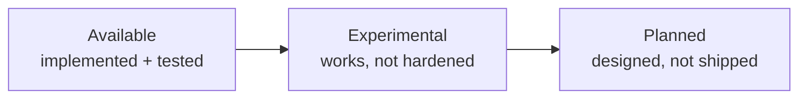

# Status

**Current state of Neuron as of `0.1.0`.** Everything in this document describes this release — not aspirational behavior.

> [!NOTE]
> The docs describe current behavior and architectural direction. Where a capability is designed for but not yet shipped — container/remote runtimes, TLS, execution-retention policies — it is labeled as planned, not promised.

---

## Available

The following surface is implemented, tested, and intended to work in 0.1.0.

### CLI (`neuron`)

| Command | Purpose |
| --- | --- |
| `neuron init` | Scaffold a project |
| `neuron register` | Build, compile, resolve modules, and register with N.O.R.E. |
| `neuron run` | Create an instance and execute, streaming live events (WebSocket, with an SSE fallback) |
| `neuron add` / `neuron remove` | Install / uninstall external module packages |
| `neuron executor list` / `neuron executor inspect [name@version]` | Manage installed modules |
| `neuron instance list` / `remove` / `clear` | Manage instances and their executions |
| `neuron daemon stop` | Stop the background runtime engine |
| `neuron version` / `--version` | Version reporting |

Also available: global configuration, environment overrides (`NEURON_*`), and local Unix-socket communication with the runtime.

### Authoring surfaces

| Surface | Status |
| --- | --- |
| **YAML** | Full project, system, service, and connector authoring; the canonical, zero-tooling surface |
| **TypeScript** | The `@neuron/sdk`, a typed system-definition language producing the same canonical manifest |
| **Go** | A minimal Go-defined system via the SDK builders (see `examples/simple_response`) |

### Runtime (N.O.R.E.)

- Registration of compiled systems with a frozen, resolved module set.
- Instances: create, list, remove, clear; restoration of persisted instances on restart.
- Execution: planning, scheduling, connector mappings and validations (CEL), cancellation, deadlines, and terminal execution states.
- Event streaming: live execution events streamed to the client over WebSocket (`/v1/ws`), with a Server-Sent Events fallback; events persisted.
- Built-in modules run in-process inside N.O.R.E. (no installation required).
- External modules hosted out-of-process:
  - **Process runtime** — long-lived native worker processes over the executor protocol.
  - **WASM runtime** — WebAssembly/WASI modules in an isolated context.
- Graceful shutdown that stops live instances cleanly.

### Modules & executors

- The unified module model: logical names, version requirements, semantic-version selection.
- Registries: `github` (GitHub Releases based) and `local` (directory backed, for offline and tests).
- Canonical executor package archives (`<name>-<version>-executor.neuron.tar.gz`) with digest verification.
- Immutable installation into `~/.neuron/executors`; frozen resolution per registered system.
- Executor protocols:
  - `neuron/executor-v1` — gRPC over a Unix socket for long-lived workers.
  - `neuron/executor-v1-json` — one-shot JSON over stdio.
- Reference module `example:echo`, compiled for both the process and WASM runtimes from the same Go source.

### Examples

- `examples/ecommerce_order` (YAML) and `examples/ecommerce_order_ts` (TypeScript) — full order-processing pipelines.
- `examples/executors` — the reference `echo` module and its build script.
- `examples/simple_response` — a minimal Go-defined system.

---

## Experimental

The following exist and work, but are not yet hardened or committed to:

- **External module resolution over GitHub Releases** — the network path is functional but the ecosystem, registry catalog conventions, and end-to-end distribution are early. The `github` registry is catalog-driven; unlisted module names are not guessed at, so only modules in the configured catalog resolve.
- **WASM executor backend** — functional, but performance and capability breadth are not yet fully characterized.
- **Execution introspection** — execution-level listing is surfaced through `neuron instance list`; a dedicated `neuron execution` inspection command is planned, and execution-history/retention policies are not configurable yet (executions are always persisted with the default store).
- **Runtime refinements** — concurrency behavior, worker-pool tuning, and restart semantics are still evolving.

---

## Planned

- **Runtime hardening** — authentication for the API, TLS for TCP, resource limits, and stronger process isolation.
- **Configurable execution-history retention policies** (`none | memory | local`).
- **Broader registry ecosystem** and published module distribution.
- **Additional executor runtimes** (container, remote).
- **Stabilization of the public SDK and executor-protocol contracts** for 1.0 compatibility guarantees.
- **Release automation** — continuous integration (Go workspace + SDK) and tag-triggered release automation are in place; publishing the first release archives and maturing the ecosystem remain ahead.

---

## Versioning & compatibility

- The product version is `0.1.0`; `neuron version` reports it.
- The `@neuron/sdk` is versioned independently as `0.1.0` and is **not yet published** to a package registry; it is consumed from this repository.
- Public contracts — the SDK API, the executor protocol, the canonical manifest, and the CLI surface — are under active development and may change without notice before 1.0.

---

## Detailed tracking

| | |
| --- | --- |
| **Known issues & work** | [TODO.md](../TODO.md) |
| **Runtime deep dives** | [docs/RUNTIME.md](./RUNTIME.md), [docs/RUNTIME_PROCESS.md](./RUNTIME_PROCESS.md), [docs/RUNTIME_WASM.md](./RUNTIME_WASM.md) |

---

## Related

| | |
| --- | --- |
| **Getting started** | Build and run your first system — [docs/GETTING_STARTED.md](./GETTING_STARTED.md) |
| **Architecture** | How the platform is put together — [docs/ARCHITECTURE.md](./ARCHITECTURE.md) |
| **Installation** | Install from release or source — [docs/INSTALLATION.md](./INSTALLATION.md) |