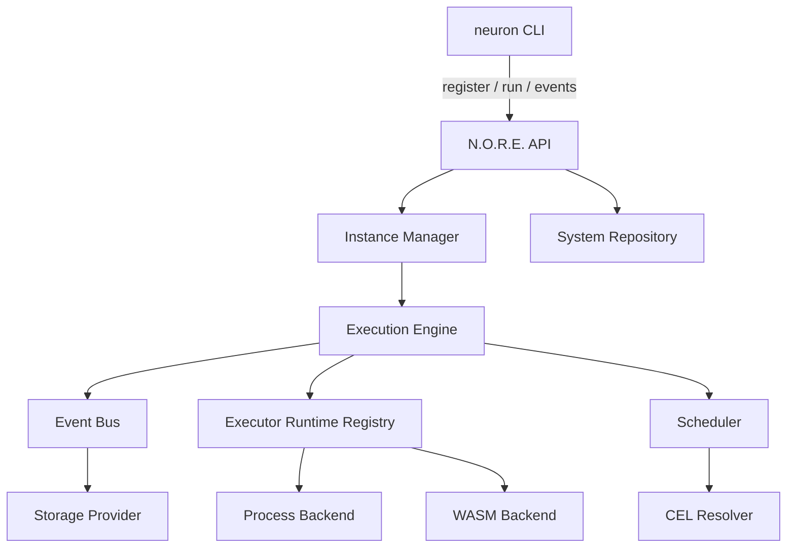
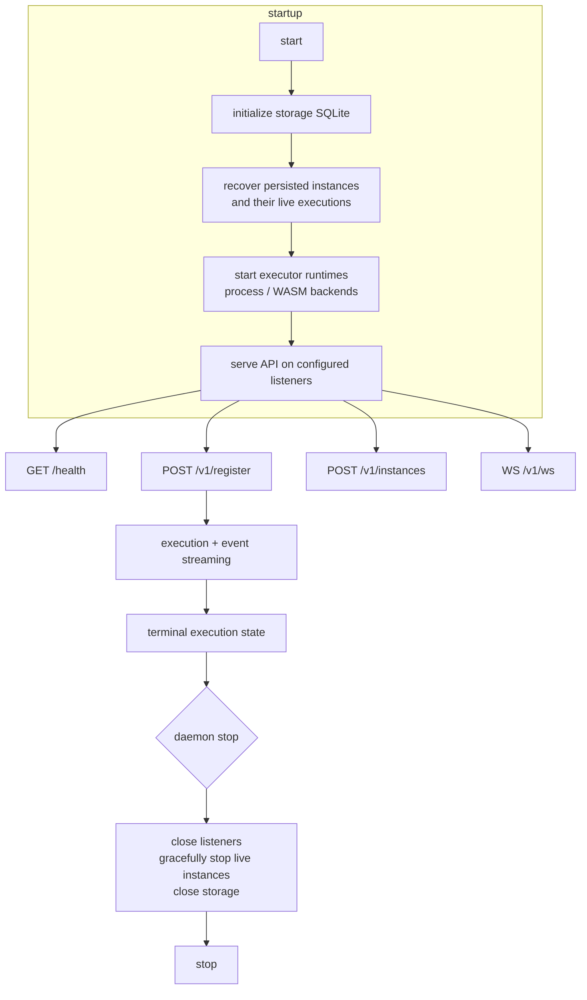
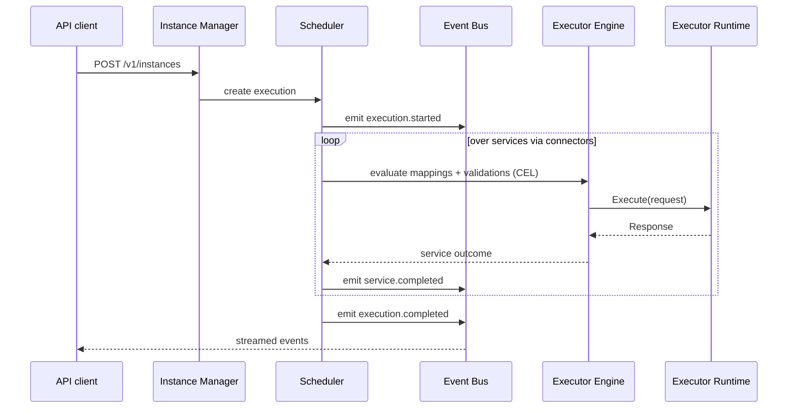
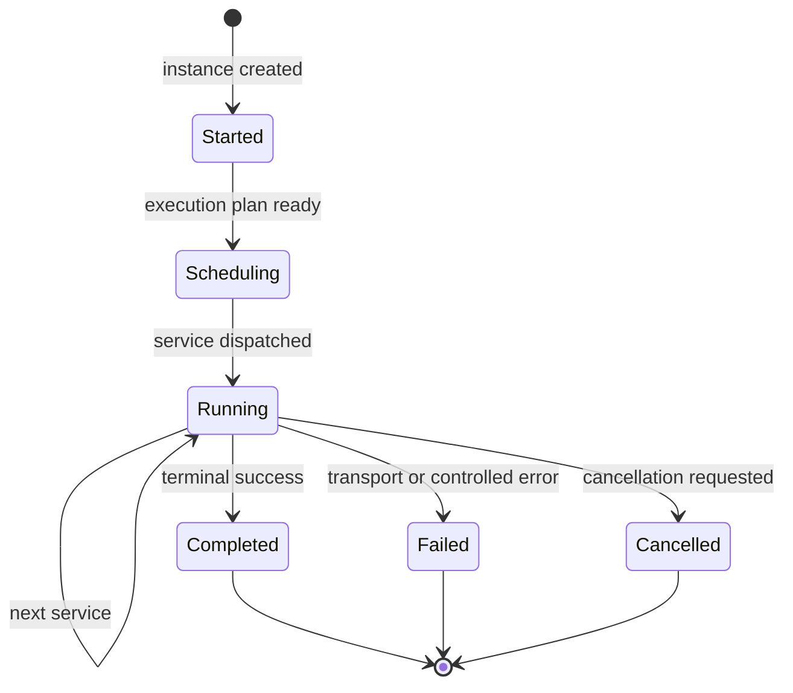
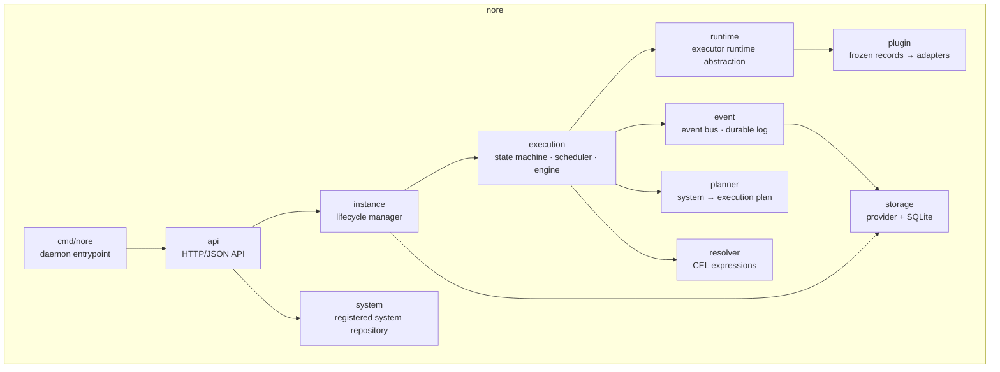
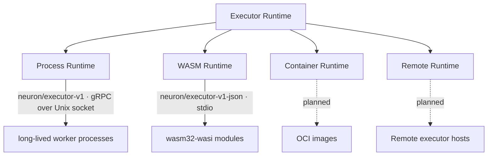
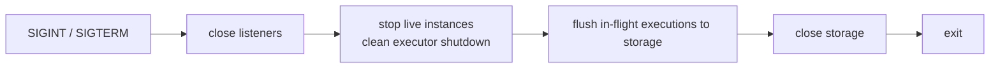

# N.O.R.E. — Neuron Operational Runtime Engine

**N.O.R.E.** is the runtime engine of Neuron: where Systems are registered, instantiated, operated, and connected to the capabilities they require.

This reference is **maintainer-focused** and describes what N.O.R.E. is, how it is structured, how to run it, and how it behaves. Users interact with N.O.R.E. exclusively through the `neuron` CLI; see [application/README.md](../application/README.md).



## Responsibilities

N.O.R.E. owns the operational side of Neuron:

| Concern | Responsibility |
| --- | --- |
| **Registration** | Receiving compiled System definitions from the CLI and persisting them |
| **Execution planning** | Compiling the registered system and its frozen executor set into a plan over an event bus |
| **Instances** | Creating, running, pausing, restarting, and removing living realizations of Systems |
| **Executors** | Hosting and supervising modules — in-process for built-ins, out-of-process for external modules (process and WASM backends) |
| **Scheduling** | Advancing executions, evaluating connector mappings and validations, handling cancellations |
| **Persistence** | Durable storage of registered systems, instances, executions, and events through an interchangeable storage provider (SQLite by default) |
| **API** | The local HTTP/JSON transport over which the CLI talks to the runtime |

N.O.R.E. deliberately does **not**:

- parse YAML or TypeScript,
- resolve or install external modules (the CLI does that and freezes the result),
- understand the business meaning of the modules it operates.

The canonical manifest is compiled by the CLI; N.O.R.E. receives the compiled core system representation.

---

## Running N.O.R.E.

In normal use you never run N.O.R.E. directly — the `neuron` CLI starts it automatically and talks to it over a Unix domain socket. The binary lives alongside the CLI in the same distribution archive.

To run it by hand (for development or debugging):

```bash
go build -o nore ./nore/cmd/nore
./nore
```

With no flags this binds a Unix socket (`~/.neuron/nore.sock`) and uses `~/.neuron/nore` as its data directory. The process prefers to live long and be supervised by the CLI, but it is a plain foreground process and shuts down cleanly on `SIGINT`/`SIGTERM`.

## Flags

```
-port string       TCP address for the N.O.R.E. API; empty disables TCP (default: Unix socket only)
-socket string     Unix socket for local CLI clients; empty disables Unix socket
                   (default: $NEURON_SOCKET or ~/.neuron/nore.sock)
-workers int       executor worker count (default 8)
-data-dir string   persistent data directory (default: $NEURON_DATA_DIR or ~/.neuron/nore)
-version           print the N.O.R.E. version and exit
```

At least one of `-port` or `-socket` must be configured.

> [!NOTE]
> The default configuration is **Unix socket only** — no TCP listener is opened unless `-port` is supplied explicitly. The socket is created with mode `0600`, so only the owning user can connect to the runtime API.
>
> Exposing N.O.R.E. over TCP (`-port :0` style) is opt-in and intended for development and remote operation where the deployment enforces its own network-level protection.

## Configuration & Environment

| Variable | Meaning |
| --- | --- |
| `NEURON_SOCKET` | Override the daemon Unix socket path |
| `NEURON_DATA_DIR` | Override the daemon persistent data directory |

Command-line flags take precedence over environment variables.

---

## Runtime Lifecycle



### API surface

| Endpoint | Operation |
| --- | --- |
| `GET /health` | Health check (used by the CLI bootstrap) |
| `POST /v1/register` | Register a compiled System |
| `GET /v1/instances` | List Instances |
| `POST /v1/instances` | Create an Instance and begin execution |
| `DELETE /v1/instances` | Remove all Instances |
| `GET /v1/instances/{id}` | Instance detail |
| `DELETE /v1/instances/{id}` | Remove an Instance |
| `POST /v1/instances/{id}/executions` | Create an execution |
| `GET /v1/instances/{id}/executions` | List executions |
| `GET /v1/instances/{id}/executions/{execID}` | Execution state |
| `GET /v1/instances/{id}/executions/{execID}/events` | List events |
| `GET /v1/instances/{id}/executions/{execID}/events/stream` | Stream events (Server-Sent Events) |
| `WS /v1/ws` | WebSocket endpoint for live event streaming |

### Execution

When an Instance is created, the planner compiles the registered System into an execution plan over the event bus. The scheduler advances the execution across the System's services and connectors, evaluates mappings and validations through the CEL resolver, and drives service executions through the executor layer.



Every transition emits an event (started, completed, failed, cancelled); events are streamed to clients and persisted according to storage policy.

Live events are streamed over the WebSocket endpoint (`WS /v1/ws`); the SSE stream (`GET .../events/stream`) remains available for transports without WebSocket support.



Executions honor deadlines, support cancellation, and finish in a terminal state (`execution.completed`, `execution.failed`, `execution.cancelled`).

---

## Internal Architecture



| Package | Responsibility |
| --- | --- |
| `cmd/nore` | Daemon entry point — flags, listeners, shutdown |
| `api` | HTTP/JSON API — transport only: validates requests, calls the instance manager and system repository, serializes responses and streams. Never interprets system semantics |
| `instance` | Lifecycle — create/remove/clear, restoration on startup, registry of live instances |
| `execution` | State machine — scheduler transitions, snapshotting, wait-for-completion, the executor engine that drives module calls |
| `event` | Single source of truth for state transitions; the durable event log used for persistence and streaming |
| `runtime` | Executor backend abstraction — one interface, multiple backends (process workers, WASM), with health checks, worker pooling, restart, and cancellation |
| `planner` | Compiles the registered System + frozen executors into an executable plan. Source-language agnostic; owns no HTTP clients, registries, or file downloads |
| `resolver` | CEL expression resolver — connector mappings and validations |
| `storage` | Provider interface + SQLite implementation — systems, instances, executions, events |
| `plugin` | Boundary between frozen executor records and the runtime backends — thin adapters, no process/socket/WASM machinery itself |
| `system` | Registered system repository and indexing |

### The executor runtime boundary

The runtime boundary inside N.O.R.E. is the **executor runtime** abstraction. One interface, multiple backends:



A backend owns starting the executor, connecting to it, health checking, executing requests, cancellation, deadlines, termination, and restart. The registry, installer, and compiler own none of that. See [docs/RUNTIME_PROCESS.md](../docs/RUNTIME_PROCESS.md) and [docs/RUNTIME_WASM.md](../docs/RUNTIME_WASM.md).

### Built-in modules

N.O.R.E. ships a small set of in-process modules for common operations. They run inside the runtime engine and require no installation or resolution. Referencing one in a system (YAML entry file or TS via the SDK) is a plain module reference; N.O.R.E. dispatches it directly to the in-process implementation.

### External modules (executors)

External modules are hosted out-of-process. After the CLI resolves, verifies, and installs a module and freezes its exact version into the registered system, N.O.R.E. launches it through the matching runtime backend:

- **Process backend** — a long-lived native worker, spawned per instance, communicating over the Neuron executor protocol (gRPC over a Unix socket), with health checks, request deadlines, cancellation, and clean termination. See [docs/RUNTIME_PROCESS.md](../docs/RUNTIME_PROCESS.md).
- **WASM backend** — a WebAssembly module loaded into the runtime in an isolated context. See [docs/RUNTIME_WASM.md](../docs/RUNTIME_WASM.md).

The full module model, protocol, and archive contract live in [docs/MODULES.md](../docs/MODULES.md).

---

## Safe Shutdown

On `SIGINT`/`SIGTERM`, N.O.R.E. closes its listeners and then **gracefully stops all live instances** before exiting (`srv.StopInstances()`). This gives executor-backed resources — worker processes and WASM modules — a clean shutdown instead of being torn down mid-operation by process exit.



Instances survive runtime restarts: on startup, N.O.R.E. restores persisted instances and their in-flight executions from storage.

---

## Security Model

- The default transport is a Unix socket with mode `0600` — local to the owning user, no network exposure.
- TCP is opt-in and the API currently has **no authentication**. Do not expose a TCP listener on an untrusted network.
- External executors are treated as untrusted code. They are verified and installed by the CLI before registration and are hosted out-of-process, isolating the runtime from third-party crashes and malicious behavior.
- Capability declarations in module manifests are metadata, not permissions. Permissions are enforced by the runtime backends.

> [!WARNING]
> The API is unauthenticated and bound to a local socket by default. Token-based authentication is tracked before any loopback exposure.

---

## Performance Characteristics

Concurrency is bounded by the executor worker pool (`-workers`, default 8). Long-lived workers are reused across requests rather than respawning per invocation, which keeps warm execution latency dominated by the executor protocol call itself rather than process startup. For deeper discussion of pool sizing, cold-start, and throughput validation, see [docs/RUNTIME.md](../docs/RUNTIME.md).

---

## Further Reading

| | |
| --- | --- |
| **Runtime deep dive** | How N.O.R.E. executes services end to end — [docs/RUNTIME.md](../docs/RUNTIME.md) |
| **Process runtime** | The process executor backend — [docs/RUNTIME_PROCESS.md](../docs/RUNTIME_PROCESS.md) |
| **WASM runtime** | The WASM executor backend — [docs/RUNTIME_WASM.md](../docs/RUNTIME_WASM.md) |
| **Modules & executors** | The unified module model — [docs/MODULES.md](../docs/MODULES.md) |
| **CLI** | The `neuron` CLI, the user-facing surface — [application/README.md](../application/README.md) |

---

## License

This application is part of Neuron, which is released under the MIT License. See [LICENSE](../LICENSE).