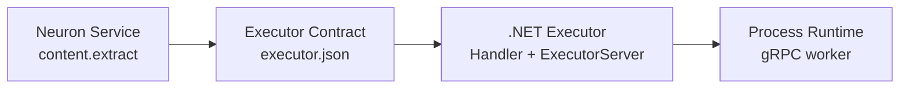

# `executor-dotnet`

The official **.NET SDK for building Neuron executors**. Implement a capability as a plain `ExecutorHandler`; the SDK handles protocol negotiation, Unix domain socket setup, readiness signaling, and lifecycle management.

An executor is a program that exposes the Neuron execution contract: an input map in, an output map (or a controlled error) out.



[.NET 10](https://dotnet.microsoft.com)
[License](../../LICENSE)

---

## Package

```text
Neuron.Executor  (namespace Neuron.Executor)
```

Requirements:

- .NET SDK 10.0 or newer (`net10.0`)
- The canonical gRPC contract in `shared/protocol/executor/v1/executor.proto`, referenced (not copied) by the SDK project

---

## How the SDK hosts an executor

This SDK implements the **`neuron/executor-v1`** wire protocol only: a long-lived gRPC server on a Unix domain socket, matching the worker model of the N.O.R.E. process runtime.

The legacy `neuron/executor-v1-json` stdin/stdout transport is deliberately **not** provided. An executor built with this SDK must be launched by the process runtime (the runtime injects `NEURON_EXECUTOR_SOCKET`); the SDK fails fast if that contract is missing.

---

## The Handler contract

An executor is implemented as an `ExecutorHandler` with four callbacks:

| Callback    | When it runs                           | Responsibility                                              |
| ----------- | -------------------------------------- | ----------------------------------------------------------- |
| `Initialize` | Once per process, before anything else | Negotiate protocol version; return identity and capabilities |
| `Execute`   | Once per execution                     | Run the capability and return the result                    |
| `Health`    | Periodically by the runtime            | Report readiness to accept requests (`null` → always healthy) |
| `Shutdown`  | Before the process terminates          | Release resources gracefully (`null` → terminate immediately) |

```csharp
var handler = new ExecutorHandler
{
    Initialize = (protocol, metadata, ct) => new ValueTask<InitializeResult>(
        new InitializeResult { ProtocolVersion = ExecutorConstants.ProtocolV1 }),
    Execute = (input, context, ct) => new ValueTask<ExecutionResult>(
        new ExecutionResult { Output = input }),
    Health = ct => ValueTask.CompletedTask,
    Shutdown = ct => ValueTask.CompletedTask,
};

return await ExecutorServer.RunAsync(handler);
```

`RunAsync` requires both `Initialize` and `Execute`; a handler missing either is rejected at startup.

`InitializeResult` carries the executor's side of the negotiation:

```csharp
public sealed class InitializeResult
{
    public string ProtocolVersion { get; init; }
    public IReadOnlyList<string> Capabilities { get; init; }
    public IReadOnlyDictionary<string, string> Metadata { get; init; }
}
```

Return the protocol version you support in `ProtocolVersion`. When left empty, the SDK fills in the canonical value (`neuron/executor-v1`), mirroring `packages/executor-go`.

`Execute` receives the resolved input map plus an `ExecuteContext` (execution id, timeout, correlation id) and returns `ExecutionResult` with an output map. Setting `ExecutionResult.Error` records a **controlled failure** — the request still succeeds over the transport, and the runtime surfaces the message as an execution failure, exactly like an error in the Go SDK.

---

## A complete executor

```csharp
using Neuron.Executor;

var handler = new ExecutorHandler
{
    Initialize = (protocol, metadata, ct) => new ValueTask<InitializeResult>(
        new InitializeResult
        {
            ProtocolVersion = ExecutorConstants.ProtocolV1,
            Capabilities = new[] { "document.metadata.extract" },
            Metadata = new Dictionary<string, string> { ["service"] = "content:document-metadata" },
        }),

    Execute = async (input, context, ct) =>
    {
        if (!input.TryGetValue("document", out var raw) || raw is not IReadOnlyDictionary<string, object?> document)
        {
            return new ExecutionResult { Error = "input.document: expected an object" };
        }

        var content = document["content"] as string ?? string.Empty;
        var metadata = ExtractMetadata(content);

        return new ExecutionResult
        {
            Output = new Dictionary<string, object?>
            {
                ["metadata"] = new Dictionary<string, object?>
                {
                    ["title"] = metadata.Title,
                    ["headings"] = metadata.Headings,
                    ["wordCount"] = metadata.WordCount,
                    ["paragraphCount"] = metadata.ParagraphCount,
                },
            },
        };
    },
};

return await ExecutorServer.RunAsync(handler);
```

`RunAsync` blocks until the runtime requests shutdown. It returns exit code `0` after a graceful stop and throws on configuration failures.

> [!TIP]
> Keep the business logic (`ExtractMetadata`) separate from the handler glue. The pure function is unit-testable without the SDK, and the handler stays a thin protocol adapter.

---

## Transport and environment

The SDK reads its transport contract from the environment injected by the N.O.R.E. process runtime:

| Variable                   | When set / meaning                                                                                   |
| -------------------------- | ---------------------------------------------------------------------------------------------------- |
| `NEURON_EXECUTOR_SOCKET`   | Path of the Unix domain socket where the gRPC server must listen. **Required.**                      |
| `NEURON_EXECUTOR_READY`    | Path of a file to create once the server is accepting connections (the launcher waits for this file) |
| `NEURON_EXECUTOR_PROTOCOL` | The protocol the runtime expects; the SDK verifies it matches `neuron/executor-v1`                   |
| `NEURON_EXECUTOR_TYPE`     | The logical executor type, e.g. `content:document-metadata` (informational)                          |
| `NEURON_EXECUTOR_VERSION`  | The resolved executor version (informational)                                                        |

The SDK cleans up a stale socket file from a crashed process before listening, so a restart never fails because an old socket file is still present.

---

## Data conversion

Inputs and outputs are dynamic maps (`IReadOnlyDictionary<string, object?>`). The SDK converts them to and from the protobuf `Value` type used on the gRPC transport, mirroring `packages/executor-go/values.go`:

| C# type                                                              | Preserved as      |
| -------------------------------------------------------------------- | ----------------- |
| `null`, `bool`                                                        | `null`, `boolean` |
| `sbyte`, `byte`, `short`, `ushort`, `int`, `uint`, `long`, `ulong`, `float`, `double` | numbers           |
| `string`, `byte[]`                                                    | string            |
| `DateTime`, `DateTimeOffset`                                          | RFC 3339 string   |
| `IReadOnlyDictionary<string, object?>`, `IDictionary<string, object?>`, other sequences of values | recursively       |
| anything else                                                         | string rendering  |

On the way back, numeric protobuf values that are whole numbers are returned as `long`; fractional values return as `double`.

---

## Executors are language-independent

> [!IMPORTANT]
> An Executor is a runtime implementation of a Service contract. It is **not** required to be written in .NET, nor compiled to WASM. `executor-dotnet` is one implementation SDK; `executor-go` is another; any language with gRPC support can implement `neuron/executor-v1`.

The gRPC contract lives once in `shared/protocol/executor/v1/executor.proto`. This SDK references that file via `Grpc.Tools` — it is never copied, so the wire contract has a single source of truth.

---

## Reference

| Resource           | Path                                                     |
| ------------------ | -------------------------------------------------------- |
| Implementation     | `packages/executor-dotnet/`                              |
| Go SDK (parity)    | [packages/executor-go](../../packages/executor-go/README.md) |
| gRPC schema        | `shared/protocol/executor/v1/executor.proto`             |
| Contract types     | `shared/types/executor`                                  |
| Process runtime    | [docs/RUNTIME_PROCESS.md](../../docs/RUNTIME_PROCESS.md) |
| Executor model     | [docs/MODULES.md](../../docs/MODULES.md)                 |

## License

MIT — see the repository `[LICENSE](../../LICENSE)` for terms.