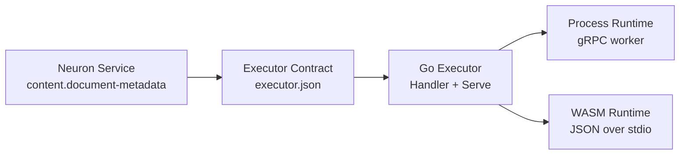
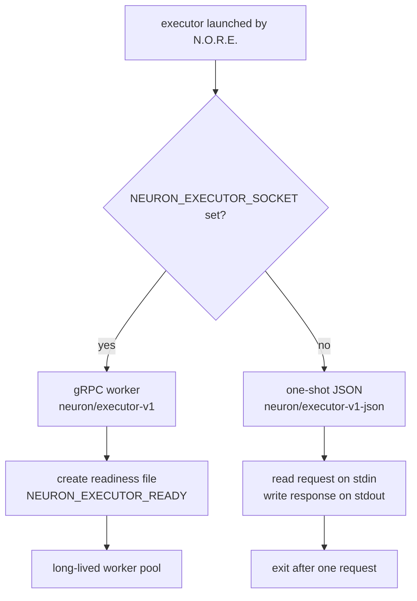

# `executor-go`

The official **Go SDK for building Neuron executors**. Implement a capability as a plain Go `Handler`; the SDK handles protocol negotiation, Unix domain socket setup, readiness signaling, and lifecycle management.

An executor is a program that exposes the Neuron execution contract: an input map in, an output map (or a controlled error) out.




[Go](https://go.dev)
[License](../../LICENSE)

---


## Module

```text
github.com/Muhammad-Jay/neuron/packages/executor-go
```

Requirements:

- Go 1.26 or newer
- `google.golang.org/grpc`
- the shared Neuron contract module `github.com/Muhammad-Jay/neuron/shared`

---


## Success on both runtimes

The same Go source works in both execution modes N.O.R.E. supports, selected automatically at startup from the environment the runtime provides:

- as a **long-lived gRPC worker** speaking `neuron/executor-v1` over a Unix domain socket, and
- as a **one-shot command** speaking `neuron/executor-v1-json` on stdin/stdout.

You never select the mode yourself. Write the executor once, declare it once in `executor.json`, and the same source serves the `process` and `wasm` runtime backends — see [One source, two runtimes](#one-source-two-runtimes).

---


## The scenario: document metadata extraction

Throughout this guide the example is a realistic capability: `content.document-metadata`, which extracts metadata from a markdown document.

Input:

```json
{
  "document": {
    "name": "quarterly-report.md",
    "content": "# Q3 Revenue\n\nRevenue increased by 18%."
  }
}
```

Output:

```json
{
  "metadata": {
    "title": "Q3 Revenue",
    "headings": ["Q3 Revenue"],
    "wordCount": 3,
    "paragraphCount": 1
  }
}
```

This is a production-shaped executor — real input structure, real output structure, structured errors for malformed input. An `echo` handler shows the mechanics; this shows a capability.

---


## The Handler contract

An executor is implemented as an `executor.Handler` with four callbacks:


| Callback     | When it runs                           | Responsibility                                               |
| ------------ | -------------------------------------- | ------------------------------------------------------------ |
| `Initialize` | Once per process, before anything else | Negotiate protocol version; return identity and capabilities |
| `Execute`    | Once per execution                     | Run the capability and return the output map                 |
| `Health`     | Periodically by the runtime            | Report readiness to accept requests (`nil` → always healthy) |
| `Shutdown`   | Before the process terminates          | Release resources gracefully (`nil` → terminate immediately) |


```go
type Handler struct {
    Initialize func(ctx context.Context, protocol string, metadata map[string]string) (*InitializeResult, error)
    Execute    func(ctx context.Context, input map[string]any) (map[string]any, error)
    Health     func(ctx context.Context) error
    Shutdown   func(ctx context.Context) error
}
```

`Serve` requires both `Initialize` and `Execute`; a handler missing either is rejected at startup.

`InitializeResult` carries the executor's side of the negotiation:

```go
type InitializeResult struct {
    ProtocolVersion string
    Capabilities    []string
    Metadata        map[string]string
}
```

Return the protocol version you support in `ProtocolVersion`. A known protocol is mirrored back; when left empty, the SDK fills in the canonical value (`neuron/executor-v1`). The constants live in `shared/types/executor`.

---


## A complete executor

```go
package main

import (
	"context"
	"fmt"
	"log"
	"strings"

	executor "github.com/Muhammad-Jay/neuron/packages/executor-go"
	shadexec "github.com/Muhammad-Jay/neuron/shared/types/executor"
)

// Document is the executor's input contract.
type Document struct {
	Name    string `json:"name"`
	Content string `json:"content"`
}

// Metadata is the executor's output contract.
type Metadata struct {
	Title          string   `json:"title"`
	Headings       []string `json:"headings"`
	WordCount      int      `json:"wordCount"`
	ParagraphCount int      `json:"paragraphCount"`
}

// extractMetadata is the capability itself. It is pure and independent of
// any transport, which makes it trivial to unit-test and reuse.
func extractMetadata(doc Document) Metadata {
	var (
		title    string
		headings []string
		words    int
		paras    int
	)
	for _, line := range strings.Split(doc.Content, "\n") {
		line = strings.TrimSpace(line)
		if line == "" {
			continue
		}
		if strings.HasPrefix(line, "#") {
			heading := strings.TrimLeft(line, "# ")
			if heading == "" {
				continue
			}
			if title == "" {
				title = heading
			}
			headings = append(headings, heading)
			continue
		}
		if strings.HasPrefix(line, "- ") || strings.HasPrefix(line, "* ") {
			continue
		}
		paras++
		words += len(strings.Fields(line))
	}
	return Metadata{Title: title, Headings: headings, WordCount: words, ParagraphCount: paras}
}

func main() {
	if err := executor.Serve(executor.Handler{
		Initialize: func(ctx context.Context, protocol string, metadata map[string]string) (*executor.InitializeResult, error) {
			return &executor.InitializeResult{
				ProtocolVersion: shadexec.ProtocolV1,
				Capabilities:    []string{"document.metadata.extract"},
				Metadata: map[string]string{
					"service": "content.document-metadata",
				},
			}, nil
		},
		Execute: func(ctx context.Context, input map[string]any) (map[string]any, error) {
			raw, ok := input["document"].(map[string]any)
			if !ok {
				return nil, fmt.Errorf("input.document: expected an object")
			}
			name, _ := raw["name"].(string)
			content, _ := raw["content"].(string)

			meta := extractMetadata(Document{Name: name, Content: content})

			return map[string]any{
				"metadata": map[string]any{
					"title":          meta.Title,
					"headings":       meta.Headings,
					"wordCount":      meta.WordCount,
					"paragraphCount": meta.ParagraphCount,
				},
			}, nil
		},
	}); err != nil {
		log.Fatal(err)
	}
}
```

`Serve` blocks until the executor is shut down. It returns `nil` after a graceful stop (or in one-shot JSON mode after one request) and an error otherwise.

> [!TIP]
> Keep the business logic (`extractMetadata`) separate from the handler glue. The pure function is unit-testable without the SDK, and the handler stays a thin protocol adapter.

---


## Transport selection

The SDK picks the transport at startup by inspecting the environment it was launched with:




| Variable                   | When set / meaning                                                                                   |
| -------------------------- | ---------------------------------------------------------------------------------------------------- |
| `NEURON_EXECUTOR_SOCKET`   | Path of the Unix domain socket. If set, the executor starts a gRPC server listening there            |
| `NEURON_EXECUTOR_READY`    | Path of a file to create once the server is accepting connections (the launcher waits for this file) |
| `NEURON_EXECUTOR_PROTOCOL` | The execution protocol the runtime expects (informational; read via `os.Getenv`)                     |
| `NEURON_EXECUTOR_TYPE`     | The logical executor type, e.g. `content:document-metadata` (informational)                          |
| `NEURON_EXECUTOR_VERSION`  | The resolved executor version (informational)                                                        |


Decisions made from this environment:

- If `NEURON_EXECUTOR_SOCKET` is set, the executor runs as a gRPC worker on the Unix domain socket at that path and signals readiness by creating the file at `NEURON_EXECUTOR_READY` once the server is accepting connections.
- If it is not set, the executor runs as a one-shot stdin/stdout command: it reads a single JSON request from stdin, writes a single JSON response to stdout, and exits. This is the mode a WASI module (and any legacy command) always uses, since WASI has no socket interface.

The SDK cleans up a stale socket file from a crashed process before listening, so a restart never fails because an old socket file is still present.

---


## Data conversion

Inputs and outputs are dynamic maps (`map[string]any`). The SDK converts them to and from the protobuf `Value` type used on the gRPC transport:


| Go type                                                                   | Preserved as      |
| ------------------------------------------------------------------------- | ----------------- |
| `nil`, `bool`                                                             | `null`, `boolean` |
| `float64`, `float32`, `int`, `int32`, `int64`, `uint`, `uint32`, `uint64` | numbers           |
| `string`, `[]byte`                                                        | string            |
| `time.Time`                                                               | RFC 3339 string   |
| `[]any`, `map[string]any`                                                 | recursively       |
| anything else                                                             | string rendering  |


On the way back, numeric protobuf values that are whole numbers are returned as `int64`; fractional values return as `float64`.

---


## One source, two runtimes

Because the SDK selects its transport from the environment, the same Go source compiles into both runtime backends:

```text
GOOS=$(go env GOOS) GOARCH=$(go env GOARCH) go build -o document-metadata .
GOOS=wasip1 GOARCH=wasm go build -o document-metadata.wasm .
```

Two manifests, one pair of binaries. The process binary declares the gRPC protocol (`neuron/executor-v1`) under the host's platform key; the WASM module declares the JSON protocol (`neuron/executor-v1-json`) under the portable `wasm32-wasi` key:

```json
{
  "apiVersion": "neuron/v1",
  "kind": "Executor",
  "metadata": { "name": "content:document-metadata", "version": "1.0.0" },
  "runtime": { "type": "process", "entrypoint": "document-metadata", "protocol": "neuron/executor-v1" },
  "services": ["content:document-metadata"],
  "capabilities": ["document.metadata.extract"],
  "platforms": { "linux-amd64": { "artifact": "document-metadata", "sha256": "..." } }
}
```

```json
{
  "apiVersion": "neuron/v1",
  "kind": "Executor",
  "metadata": { "name": "content:document-metadata", "version": "1.0.0" },
  "runtime": { "type": "wasm", "entrypoint": "document-metadata.wasm", "protocol": "neuron/executor-v1-json" },
  "services": ["content:document-metadata"],
  "capabilities": ["document.metadata.extract"],
  "platforms": { "wasm32-wasi": { "artifact": "document-metadata.wasm" } }
}
```

> [!NOTE]
> `capabilities` describes what the executor *claims* to provide; it is metadata, not permission. Actual permissions are enforced by the runtime at the execution boundary.

To distribute both artifacts as one versioned unit, pack each pair into a canonical executor package archive (`<name>-<version>-executor.neuron.tar.gz`: `executor.json` plus the platform artifact at the archive root). Registries prefer the archive over per-platform assets and reconcile the inner manifest at install time.

---


## Smoke-testing locally

You do not need N.O.R.E. to exercise the JSON path. A one-shot executor reads a single `{"input": {...}}` document on stdin and writes `{"output": {...}}` to stdout:

```text
printf '{"input":{"document":{"name":"report.md","content":"# Q3 Revenue\n\nRevenue increased by 18%."}}}' | ./document-metadata
{"output":{"metadata":{"title":"Q3 Revenue","headings":["Q3 Revenue"],"wordCount":3,"paragraphCount":1}}}
```

---


## Executors are language-independent

> [!IMPORTANT]
> An Executor is a runtime implementation of a Service contract. It is **not** required to be written in Go, nor compiled to WASM.
>
> The implementation may be written in Go, .NET, Java, Rust, Python, another language, or authored as a WebAssembly module, whatever speaks the declared protocol. `executor-go` is one implementation SDK for building executors; it is never a requirement.

The two declared protocols are language-neutral:

- `neuron/executor-v1` — gRPC: implement `ExecutorService` from the proto schema in `shared/protocol/executor/v1/executor.proto` in any language with gRPC support.
- `neuron/executor-v1-json` — one-shot: read one JSON request from stdin, write one JSON response to stdout, and exit.

---


## Reference


| Resource           | Path                                                     |
| ------------------ | -------------------------------------------------------- |
| Implementation     | `packages/executor-go/`                                  |
| gRPC schema        | `shared/protocol/executor/v1/executor.proto`             |
| Contract types     | `shared/types/executor`                                  |
| Process runtime    | [docs/RUNTIME_PROCESS.md](../../docs/RUNTIME_PROCESS.md) |
| WASM runtime       | [docs/RUNTIME_WASM.md](../../docs/RUNTIME_WASM.md)       |
| Executor model     | [docs/MODULES.md](../../docs/MODULES.md)                 |
| Reference executor | `examples/executors/echo` (single source, native + WASI) |


## License

MIT — see the repository `[LICENSE](../../LICENSE)` for terms.