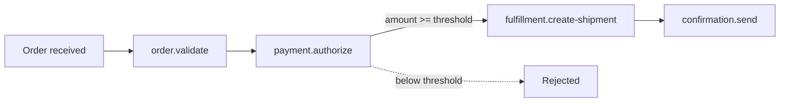
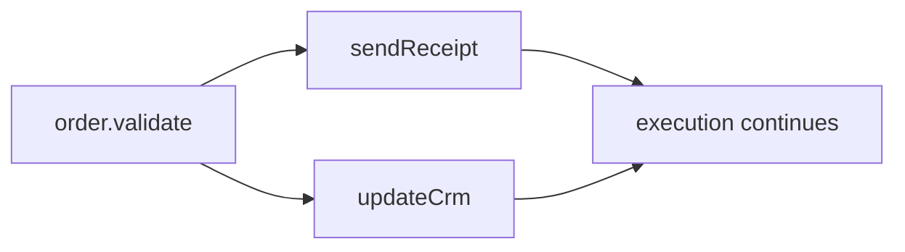

# `@neuron/sdk`

A TypeScript SDK for defining **typed, composable Neuron systems** — describe capabilities, their contracts, and how they connect. The SDK compiles everything into a portable JSON **manifest** that the Neuron compiler and runtime consume.

```mermaid
flowchart LR
    A[TypeScript<br/>define services, contracts, connections] --> B[@neuron/sdk]
    B --> C[SystemManifest<br/>canonical JSON]
    C --> D[neuron compiler]
    D --> E[N.O.R.E. runtime]
```

> [!IMPORTANT]
> The SDK defines systems. It does not execute them.
> The manifest it produces is consumed by the Neuron compiler and runtime.

[](https://github.com/Muhammad-Jay/neuron/releases)
[](https://www.typescriptlang.org)
[](../../LICENSE)

---

## Quick install

```bash
pnpm add @neuron/sdk
```

---

## The scenario

Throughout this guide, a single production scenario illustrates every SDK feature: **marketplace order fulfillment**.



Six capabilities, typed contracts, a conditional guard, and a final manifest. By the end of this guide you will have defined the entire pipeline.

---

## Define a capability

A `Service` is a named unit of work. Every service has an **identity**, an **executor** (the machinery that runs it), and typed **input/output contracts**.

```ts
import { Service } from "@neuron/sdk";

const validateOrder = Service({
  name: "order.validate",
  version: "1.0.0",
  description: "Validate an incoming order before processing",
})
  .executor({ name: "neuron:core:set" })
  .inputSchema<{ order: Order }>()
  .outputSchema<{ order: Order }>();
```

| Field | Purpose |
| --- | --- |
| `name` | Logical identity — the name services, connectors, and the system reference |
| `version` | Semver version — tracked in the manifest and frozen into registrations |
| `description` | Human-readable purpose (optional, for documentation and registries) |

---

## Contracts — what goes in and out

Contracts tell TypeScript exactly what a service accepts and produces. Two approaches are available, and you can mix them freely.

### Typed contracts (generic form)

The preferred approach for TypeScript: the contract is a TypeScript type. Autocomplete, wrong-field errors, and type mismatches are caught at compile time.

```ts
type Order = {
  id: string;
  customerId: string;
  customerEmail: string;
  currency: string;
  totalCents: number;
  items: { sku: string; name: string; qty: number; priceCents: number }[];
  shippingAddress: { street: string; city: string; zip: string };
};

const validateOrder = Service({
  name: "order.validate",
  version: "1.0.0",
})
  .executor({ name: "neuron:core:set" })
  .inputSchema<{ order: Order }>()
  .outputSchema<{ order: Order }>();
```

The generic form produces type-safe expressions everywhere: `validateOrder.output.order` is fully typed, and referencing a field that doesn't exist is a compile error.

### Runtime schema builders

For cases where runtime validation rules are needed — maximum lengths, required fields, format constraints — the SDK provides builder functions:

```ts
import { string, number, boolean } from "@neuron/sdk";

const authorizePayment = Service({
  name: "payment.authorize",
  version: "1.0.0",
}).inputSchema({
  orderId: string().required(),
  amountCents: number().min(1),
  currency: string().required(),
}).outputSchema({
  authorizationId: string().required(),
  approved: boolean(),
});
```

Runtime rules are encoded into the manifest alongside the structural schema, giving the runtime validation information it can enforce before execution.

> [!NOTE]
> You cannot mix the generic form and the builder form for the same service. Choose the form that best fits the service's contract.

---

## Expressions — referencing data across services

When services are composed, data flows between them. Expressions provide a typed, safe way to reference any field in a service's output or input without constructing raw strings.

```ts
validateOrder.output.order          // Expression<Order>
validateOrder.output.order.id       // Expression<string>
authorizePayment.output.approved    // Expression<boolean>
```

Autocomplete shows exactly the declared output fields. Referencing an unknown field is a compile error:

```ts
// @ts-expect-error — `nonExistent` is not a declared output
validateOrder.output.nonExistent
```

### Conditions

Expressions carry comparison operators that build guard conditions:

```ts
import { type Expression } from "@neuron/sdk";

const approved: Expression<boolean> =
  authorizePayment.output.approved.equals(true);

const thresholdMet: Expression<boolean> =
  authorizePayment.output.amountCents.greaterThanOrEqualTo(1000);
```

Available operators: `equals`, `notEquals`, `greaterThan`, `greaterThanOrEqualTo`, `lessThan`, `lessThanOrEqualTo`, `and`, `or`.

---

## Binding input to a service

`.withInput()` binds a service's input fields to values, expressions, or a connection. It is the primary way to feed data into a service.

### Automatic binding with expressions

Map another service's output fields to this service's input:

```ts
authorizePayment.withInput({
  order: validateOrder.output.order,
  amountCents: validateOrder.output.order.totalCents,
  currency: validateOrder.output.order.currency,
});
```

Every binding is checked against the target's input schema at compile time — wrong field names and wrong types are caught before you run anything:

```ts
// @ts-expect-error — currency is string, but orderId expects string +
// the expression resolves to a different string type mismatch
authorizePayment.withInput({
  orderId: validateOrder.output.order.totalCents, // number, not string
});
```

### Literal values

Bindings can include static values alongside expressions:

```ts
githubRead.withInput({
  owner: "Muhammad-Jay",
  repository: "neuron",
  path: "README.md",
});
```

---

## Composing services — `.next()`

`.next()` wires one service to the next, producing a linear pipeline. Chain as many steps as needed:

```ts
const pipeline = validateOrder
  .withInput({ order: systemInput.order })
  .next(
    authorizePayment.withInput({
      order: validateOrder.output.order,
      amountCents: validateOrder.output.order.totalCents,
      currency: validateOrder.output.order.currency,
    })
  )
  .next(
    capturePayment.withInput({
      order: authorizePayment.output.order,
      amountCents: authorizePayment.output.amountCents,
    })
  );
```

### Guard conditions

The second argument to `.next()` is an optional guard. The next step runs **only when the condition holds**. If it fails, a controlled failure is recorded with the given message:

```ts
authorizePayment.next(
  capturePayment.withInput({
    order: authorizePayment.output.order,
    amountCents: authorizePayment.output.amountCents,
  }),
  {
    when: authorizePayment.output.amountCents.greaterThanOrEqualTo(1000),
    message: "Payment below authorization threshold",
  }
);
```

Guard conditions are compiled into the manifest's connector validation rules, and evaluated at runtime by the CEL resolver.

---

## Explicit mapping — `.connect()`

When automatic field-by-field binding isn't enough — different field names, a transformation, or referencing a source that isn't the direct previous step — use `.connect()` to define an explicit mapping.

`.connect()` is fully typed: the callback receives the source output, and the returned object is checked against the target's input schema:

```ts
import { connect } from "@neuron/sdk";

// Map a GitHub-read output to an analyzer's expected input shape
const githubToAnalyzer = connect<GitHubReadOutput, AnalyzeInput>(
  (source) => ({
    content: source.output.content,
    path: source.output.path,
    region: "us-east-1", // literal value
  })
);

analyzeContent.withInput(githubToAnalyzer);
```

You can pass the connection directly to `.next()`:

```ts
githubRead.next(analyzeContent.withInput(githubToAnalyzer));
```

### Adding conditions to a connection

Connections support `.when()` for conditional logic — useful when a filter should gate an entire mapping:

```ts
import { connect } from "@neuron/sdk";

const verifiedOnly = connect<{ verified: boolean; id: string }, { id: string }>(
  (src) => ({ id: src.output.id })
).when(src.output.verified.equals(true), "User not verified");

saveUser.withInput(verifiedOnly);
```

Reference a field that doesn't exist on the source and TypeScript catches it:

```ts
connect<{ id: string }, { content: string }>((source) => ({
  // @ts-expect-error — source output has no `content` field
  content: source.output.content,
}));
```

---

## Parallel execution — `Parallel()`

`Parallel()` runs multiple branches concurrently. The parallel node completes when all branches complete:

```ts
import { Parallel } from "@neuron/sdk";

const notify = Parallel(
  sendReceipt.withInput({ email: order.output.customerEmail }),
  updateCrm.withInput({ customerId: order.output.customerId })
);

order.next(notify);
```

The manifest produces a parallel composition node with each branch wired to the preceding step:



Branches reference the same preceding step's output — the source is shared across all branches.

---

## The system — composing the full pipeline

A `System` ties everything together. It declares the system's identity, an optional typed input contract, and the service composition:

```ts
import { System } from "@neuron/sdk";

const manifest = System({
  name: "order-fulfillment",
  version: "1.0.0",
  description: "Validate, authorize, and fulfill customer orders",
})
  .inputSchema<{ order: Order }>()
  .withParams((input) =>
    validateOrder
      .withInput({ order: input.order })
      .next(
        authorizePayment.withInput({
          order: validateOrder.output.order,
          amountCents: validateOrder.output.order.totalCents,
          currency: validateOrder.output.order.currency,
        })
      )
      .next(
        createShipment.withInput({
          order: authorizePayment.output.order,
        }),
        {
          when: authorizePayment.output.amountCents.greaterThanOrEqualTo(1000),
          message: "Payment authorization threshold not met",
        }
      )
      .next(
        sendConfirmation.withInput({
          order: createShipment.output.order,
          email: createShipment.output.order.customerEmail,
        })
      )
  )
  .toManifest();

export default manifest;
```

### `.withParams()` vs `.run()`

| Method | Use when |
| --- | --- |
| `.withParams((input) => ...)` | The system receives typed input that feeds into the first service |
| `.run(firstService.withInput({...}))` | The first service has all its inputs resolved at build time (no runtime input) |

`.withParams()` calls `.run()` internally — the difference is purely ergonomic. The `input` parameter is typed by the preceding `.inputSchema<T>()` and compiled into `execution.input` references in the manifest.

---

## What `toManifest()` produces

`toManifest()` walks the composition tree, collects every service definition, derives the connectors between them, and produces the final manifest:

```json
{
  "apiVersion": "neuron/v1",
  "kind": "System",
  "metadata": {
    "name": "order-fulfillment",
    "version": "1.0.0",
    "description": "Validate, authorize, and fulfill customer orders"
  },
  "services": [
    { "name": "order.validate", "version": "1.0.0", "executor": { "name": "neuron:core:set" }, "inputs": [...], "outputs": [...] },
    { "name": "payment.authorize", "version": "1.0.0", "executor": { "name": "neuron:core:set" }, "inputs": [...], "outputs": [...] }
  ],
  "connectors": [
    { "from": "order.validate", "to": "payment.authorize", "mappings": [...], "validations": [...] }
  ],
  "definition": {
    "kind": "sequence",
    "steps": [...]
  }
}
```

| Field | What it contains |
| --- | --- |
| `services` | Every service definition — identity, executor, contracts, validation rules |
| `connectors` | Derived connections — field mappings and guard conditions between services |
| `definition` | The composition tree: `sequence` for chains, `parallel` for concurrent branches |

> [!NOTE]
> You never author `connectors` directly. The SDK derives them from `.next()`, `.withInput()`, and `.connect()` calls.

---

## The CLI

The SDK ships a small CLI to build your project into a manifest:

```bash
npx neuron-sdk build
```

This compiles the entry file (default `index.ts`, configurable in `neuron.config.ts`) and writes the manifest to `.neuron/manifest.json`.

```bash
npx neuron-sdk version   # print the SDK version
npx neuron-sdk help      # show usage
```

### Configuration

```ts
// neuron.config.ts
import { defineConfig } from "@neuron/sdk";

export default defineConfig({
  entry: "./system.ts",
});
```

The `entry` must default-export the compiled manifest from `System(...).toManifest()`.

---

## Package exports

| Export | Purpose |
| --- | --- |
| `Service` | Define a named capability with executor, contracts, and metadata |
| `System` | Define a system identity, input schema, and composition tree |
| `Parallel` | Declare concurrent service branches |
| `connect` | Explicit field mappings between source output and target input |
| `defineConfig` | SDK CLI configuration |
| `string`, `number`, `boolean`, `list`, `record` | Runtime schema builders with validation rules |
| `Expression` | Typed proxy representing a service output field |
| `ServiceDefinition`, `ServiceReference` | Service identity and reference types |
| `Composition`, `Connection`, `InputBindings`, `ExecutionConfig` | Composition and binding internals |
| `SystemManifest`, `ServiceManifest`, `ConnectorManifest` | Manifest structure types |
| `Infer`, `Schema`, `SchemaField` | Schema type inference |

---

## Development

```bash
pnpm install          # link workspace
pnpm build:sdk        # build to dist/ via tsup
pnpm test:sdk         # run vitest
pnpm typecheck:sdk    # tsc --noEmit
```

Tests live in `packages/sdk/test/` and cover services, expressions, composition, connections, schemas, and full system manifests.

## Versioning and compatibility

- Current version: **0.1.0**
- The public API surface listed above is treated as a contract; changes are tracked and documented
- The SDK is developed in this monorepo and consumed from source via `pnpm install`
- Language target: modern Node.js with full TypeScript 5.x support; the SDK builds to ESM and CJS

## License

[MIT](https://github.com/Muhammad-Jay/neuron/blob/main/LICENSE) — see the repository `LICENSE` for terms.
